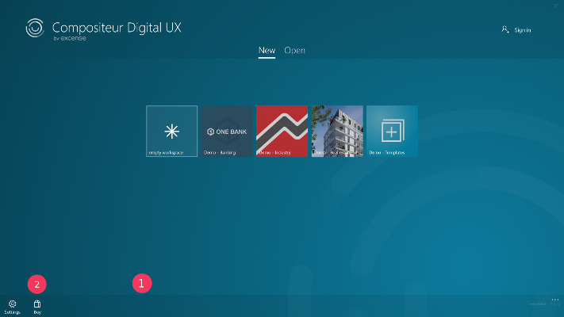

# Administrative Guide

Follow this guide to learn how you can manage your Compositeur Digital UX administrative data : account, licenses, Compositeur Digital folders...

## Summary

* [Use your Compositeur Digital UX account](account.md)
* [Purchase a Compositeur Digital UX license](#purchase-a-compositeur-digital-ux-license)
  * [In-app purchase](#in-app-purchase)
* [Add existing Compositeur Digital folders](#add-existing-compositeur-digital-folders)

## [Use your Compositeur Digital UX account](account.md)
You can connect to your Compositeur Digital UX account to unlock some functionalities.

## Purchase a Compositeur Digital UX license

### In-app purchase

Compositeur Digital UX offers in-app purchase. If you decide to purchase the product, all the restrictions which come with the free version will be removed and you'll use an unlimited version of Compositeur Digital UX. 

1. On the app start page, click the `...` button at the bottom right corner of the page.
1. Click on the `Buy` button.
1. Follow the buying instructions.
1. Your purchase has been authorized, congratulations!

## Add existing Compositeur Digital folders

By default, your universes are all stored under a single folder of your personal computer. This folder is `Documents\Compositeur Digital UX`.

Depending on your enterprise configuration, you could have an access to a shared storage system (e.g. Microsoft SharePoint, Google Drive, Dropbox, ect). You can add these folders as Compositeur Digital folders. It means that when you start Compositeur Digital UX, the system will check if there are universes in all the folders you have set.

Using a shared storage system is very convenient to share your universes with all the people who need to use Compositeur Digital UX.

To add existing Compositeur Digital folders:

1. In the Universe page open the "Settings" menu.
1. Tap on `Add existing Compositeur Digital folders`
1. Pick your folder.
1. That's all &#x1F604;

[Back to Documentation](../index.md)
