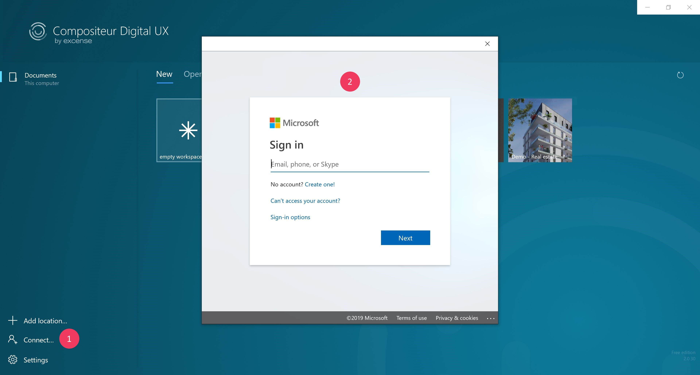
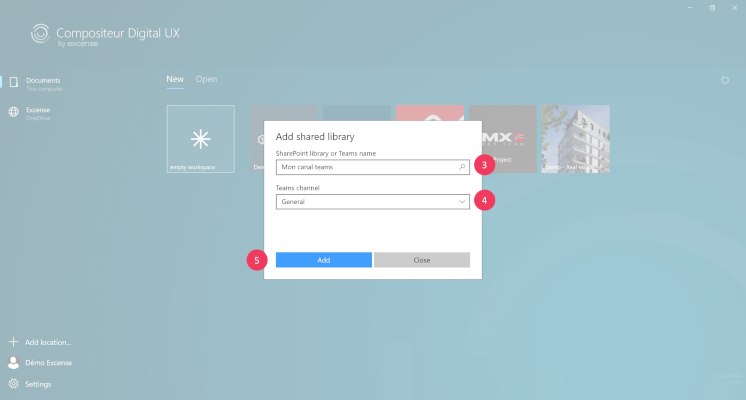

# Administrative Guide

Follow this guide to learn how you can manage your Compositeur Digital UX administrative data : account, licenses, Compositeur Digital folders...

## Summary

* [Compositeur Digital UX account](#compositeur-digital-ux-account)
  * [Sign-in](#sign-in)
  * [Sign-out](#sign-out)
* [Office365 account](#office365-account)
* [Add existing Compositeur Digital folders](#add-existing-compositeur-digital-folders)

## Compositeur Digital UX account

The Compositeur Digital UX offers a preview mode a with a limited set of features without account creation. 

If you have an existing Compositeur Digital account please follow the description below to sign in from the application. 

Alternatively, you can create an account [here](http://www.compositeurdigital.com/Account/Register) and [contact us](mailto:contact@excense.fr) or purchase a license.

### Sign-in

1. On the app start page, click on the `Settings` button.

2. On the settings page, click on `Add license`, under `Compositeur Digital license`.
1. Enter your username and password and click on `Sign in`.
1. You're connected! Your name and license type appears under `Compositeur Digital license`. 

**Note** : The device will store your credentials. Compositeur Digital UX will use the last signed-in account anytime you start a new session. If you have installed Compositeur Digital UX on a shared device, like a Microsoft Surface Hub, once you have linked a Compositeur Digital license to the device, you won't be able to remove the license unless you [contact our support team](mailto:support@excense.fr)

### Sign-out

At any time, you can freely decide to sign out.

1. On the app start page, click on the `Settings` button.
1. On the settings page, click on your name under `Compositeur Digital license`, then click on `Sign out`.

## Office365 account

Compositeur Digital UX allows you to directly sign in to your Office365 tenant. Doing so, you can stream content from your SharePoint libraries, or Microsoft Teams channels and work on a device that does not have your documents downloaded.

**Note** : This way of accessing your documents requires that you have an internet connection available each time you request your streamed universe.

### Sign in

1. On the app start page, click on the `Connect...` button. 
1. Follow the Office365 sign in instructions.
1. You're connected.

### Sign out

1. On the app start page, click on your Office 365 account.
1. Click on `Sign out`.

### Microsoft Teams

Once your Office365 account has been added, you can access content from your Microsoft Teams channels. To do so, you have to create a `Compositeur Digital UX` folder inside your channel. 

In the screenshot above, i have a Team called `Mon canal teams`, with a channel called `General`. Inside the `General` channel files, i have created a folder `Compositeur Digital UX`. This folder contains universes. 

From my Compositeur Digital UX app, I can stream this library.

**Note** : Your channel must contain a `Compositeur Digital UX` folder at its root.

1. On the app start page, click on your `Add location...`
1. Click on `Teams or SharePoint library`.

3. Enter the name of your Teams.
1. Pick the Teams channel amongst the proposed choices
1. Click on `Add`.

6. The source has been added to your sources list. 

### SharePoint site

Let's take another example. I have a SharePoint site called `My site`. Under this site, I have a `Documents` library. Inside this library, I have a folder called `Compositeur Digital UX`, which contains universes. 

**Note** : Your site's library must contain a `Compositeur Digital UX` folder at its root.

1. On the app start page, click on your `Add location...`
1. Click on `Teams or SharePoint library`
1. Enter the name of your SharePoint site.
1. Pick the name of the library that contains a `Compositeur Digital UX` folder.
1. Click on `Add`.
1. The source has been added to your sources list. 

## Add existing Compositeur Digital UX folders

By default, your universes are all stored under a single folder of your personal computer. This folder is `Documents\Compositeur Digital UX`.

Depending on your enterprise configuration, you could have an access to a shared storage system (e.g. Microsoft SharePoint, Google Drive, Dropbox, ect). You can add these folders as Compositeur Digital folders. It means that when you start Compositeur Digital UX, the system will check if there are universes in all the folders you have set.

Using a shared storage system is very convenient to share your universes with all the people who need to use Compositeur Digital UX.

To add existing Compositeur Digital folders:

1. In the Universe page open the "Settings" menu.
1. Tap on `Add existing Compositeur Digital folders`
1. Pick your folder.
1. That's all &#x1F604;

[Back to Documentation](../index.md)
