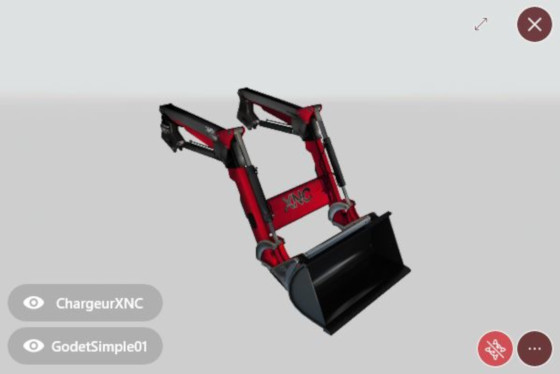
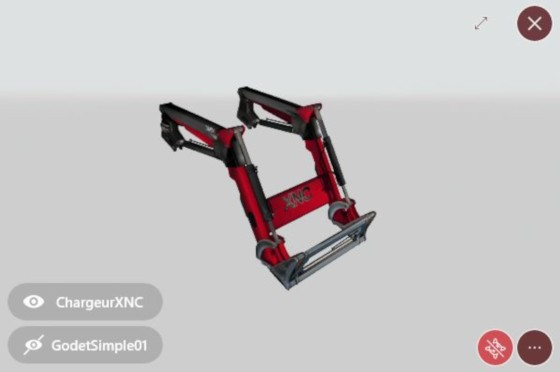

# 3D Objects

This content type allows you to directly visualize and manipulate 3D objects (`.3ds`, `.obj`).

To interact with a 3D object, press the manipulation button at the center of the item : it starts the manipulation mode.

In manipulation mode, slide your finger on the item to rotate the object. If you don't touch the object for 10 seconds in manipulation mode, it will automatically disable the manipulation mode and your item will behave normally when you touch it.
You can also press the `end manipulation` button (next to the action button) to end manipulation.

When your 3D objects in composed of various files, you can select which part of the object you want to display, or put the focus on a specific part.

To hide/show a part, tap on the check box next to the name of the part you want to hide/show. 

To put/remove the focus on/from a part, tap on its name.

## Summary
* [Actions within Compositeur Digital UX](#actions-within-compositeur-digital-ux)
* [Content extension](#content-extension)
* [Create a 3D object](#create-a-3d-object)
* [Metadata available](#metadata-available)
* [Download a sample](#download-a-sample)

## Actions within Compositeur Digital UX

3D objects items support the following action. To have a complete overview of each action, [see the section Actions](actions.md)

**Actions menu**

| Annotate | Capture  | Duplicate | Save as  | Selection | Share    | 
|:--------:|:--------:|:---------:|:--------:|:---------:|:--------:|
| &#x2716; | &#x2714; | &#x2714;  | &#x2716; | &#x2714;  | &#x2716; |

**Interaction with the item**

| Manipulation Mode | Focus Part | Show/Hide Part |
|:-----------------:|:-----------|:---------------|
| &#x2714;          | &#x2714;   | &#x2714;       |

## Content extension

To use a 3d object, put the models and all the attached files (material lib, textures, bitmaps) in a folder, and add the extension `.3ds` or `.obj` at the end of the name of your folder.
Inside your 3d object folder, only use files that end with `.3ds`, `.bmp`, `.dds`,`.jpeg`, `.jpg`, `.mtl`, `.obj` or `.png`.

## Create a 3D object

1. In your environment folder, create a folder named `<Name of your 3D model>.3ds` (e.g. `My loader.3ds`).
1. Drag and drop all the files which are composing your 3d models in this folder.
1. (Optional) Add skybox file named `_skybox.dds`.
1. (Optional) Add an image (`.jpg` or `.png`) named `_preview` to change the preview.

## Metadata available

| Metadata Key                      | Type     | Default | Description |
|:--------------------------------- |:---------|:--------|:-|
| `obj3D.backgroundcolor`           | `color`  | #dce1e1 | sets a solid background color |
| `obj3D.camera.h`                  | `number` | 0       | sets the default azimuth (horizontal rotation) for the camera position |
| `obj3D.camera.v`                  | `number` | 0       | sets the default pitch (vertical rotation) for the camera position |

## Download a sample

A Demo Universe which contains samples for panorama contents is available, [give it a try!](../Demo-Universe.zip) &#x1f604;

Next : [Guestbook (Compositeur Digital UX format)](guestbook.md)

[Back to Supported Content](index.md)
