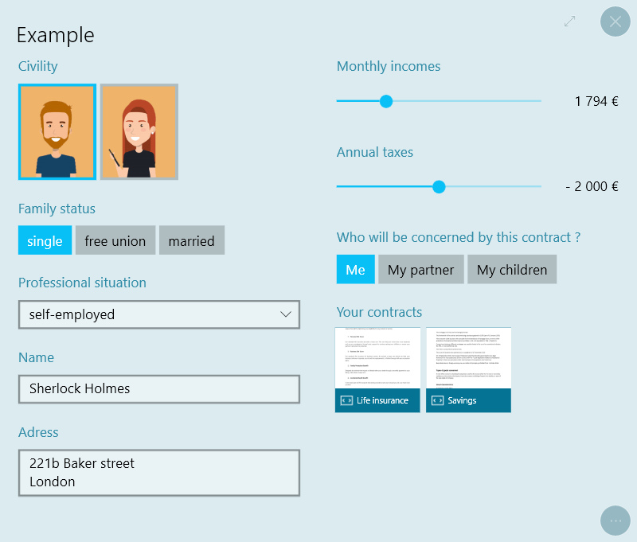

# Form

This type of content allows you to display interactive Form that will help you collect informations.



## Content extension

To create a form, put all the items you need in a folder, and add the extension `.form` at the end of the name of your folder.

Inside your folder, provide a file called `_questions.xml`

## <a name="contents"></a>Contents : `_questions.xml`

A form is composed of small elements to present or collect informations : 
* `<input>` to collect informations
* `<presenter>` to display informations

They both can be described with the following attributes :
* `type` : what the element will look like (see sections [Input Types](#input-types) and [Presenter Types](#presenter-types))
* `text` : the title or question displayed above the element
* `tooltip` : adds a question mark button next to the title to display the text given here
* `valuekey` : store and retrieve the value of an input under this key
* `visiblewhen` : show the element only when the condition given is fulfilled (see section [Elements Visibility](#elements-visibility))

## Organize elements
Inputs and presenters can be written in the order of appearance inside the tag `form` or organised into columns thanks to the tag `<section>`

*Examples*
Four inputs displayed in a single column :
```xml
<form>
    <input />
    <input />
    <input />
    <input />
</form>
```

Four elements displayed into two columns :
```xml
<form>
    <section>
        <input />
        <input />
    </section>
    <section>
        <input />
        <input />
    </section>
</form>
```

## <a name="input-types"></a>Input Types

### Single choice


```xml
<input type="singlechoice" text="Family status">
    <choice text="single" />
    <choice text="free union" />
    <choice text="married" />
</input>
```
Add as much `choice` tag as you have answers inside the input.
The answers can also be images if you put images inside the form folder, using their names to fill the attribute `image`.
If both `text` and `image` attributes are filled, the text will be displated at the bottom of the image.


```xml
<input type="singlechoice" text="Civility" >
    <choice image="male.png" />
    <choice image="female.png" />
</input>
```

### Multiple choice


```xml
<input type="multiplechoice" text="Who will be concerned by this contract ?">
    <choice text="Me" />
    <choice text="My partner" />
    <choice text="My children" />
</input>
```
### Single line text
A free-text zone on a single line.


```xml
<input type="singlelinetext" text="Name" />
```
### Multiple line text


```xml
<input type="multiplelinetext" text="Adress" />
```
### Slider


```xml
<input type="slider" text="Monthly incomes" minvalue="0" maxvalue="8000" format="# ##0 €" minlabel="no income" maxlabel="+ 8 000 €" />
```

* `minlabel` and `maxlabel` are non mandatory attributes but allows you to cusomize the displayed values.
* For possible `format` values see [standard format](https://docs.microsoft.com/en-gb/dotnet/standard/base-types/standard-numeric-format-strings) and [custom format](https://docs.microsoft.com/en-gb/dotnet/standard/base-types/custom-numeric-format-strings)
* the attribute `frequency` sets the interval between two possible values

You can also specify all possible answers of the slider with `choice` tags :


```xml
<input type="slider" text="Annual taxes">
    <choice text="no taxes" />
    <choice text="- 2 000 €" />
    <choice text="+ 2 000 €" />
</input>
```

### Combobox
To list a big quantity of answers in a reduced space, its recommanded to use a `combobox` instead of a `singlechoice`


```xml
<input type="combobox" text="Professional situation">
    <choice text="employee" />
    <choice text="unemployed" />
    <choice text="self-employed" />
</input>
```

## <a name="presenter-types"></a>Presenter Types

### Documents


```xml
<presenter type="documents" text="Your contracts">
    <entry text="Life insurance" source="contract 1.pdf" />
    <entry source="Savings.pdf" />
</presenter>
```

## Other Values

A `<choice>` of type `novalue` adds a check box under the input to deselect all other answers.


```xml
<input type="slider" text="Monthly incomes" minvalue="0" maxvalue="8000" format="# ##0 €">
    <choice type="novalue" text="I don't want to answer" />
</input>
```

To allow the user to fill an other value than the ones you present, add a `<choice>` of type `othervalue`.

```xml
<input type="multiplechoice" text="Who will be concerned by this contract ?">
    <choice text="Me" />
    <choice text="My partner" />
    <choice text="My children" />
    <choice type="othervalue" text="other : " />
</input>
```


## <a name="elements-visibility"></a>Elements visibility
You can choose to display an element `X` (input, presenter or section) based on the value of an input `Y` using the attribute `visiblewhen`.
Its value must have the pattern `key` `comparator` `value(s)`.

The key is the `valueKey` attribute of the input `Y`

The different comparators allow to test :
* equality `=`
* difference `!=`
* numeric comparisons (`<`, `<=`, `>=`, `>`)
* unstrict containance `=*`

*Examples*
If we have a multiple choice input with the possible answers `A`, `B` and `C`, we can have the following visbility behaviors on an other element :
* `visiblewhen="myKey=A"` : visible if the answer `A` is the only one selected
* `visiblewhen="myKey!=A"` : visible if `B`, `C` or both are selected
* `visiblewhen="myKey=*A"` : visible if at least `A` is selected (`B` and `C` can also be selected)
* `visiblewhen="myKey=B&C"` : visible if `B` and `C` are selected and `A` is not
* `visiblewhen="myKey=B|C"` : visible if `B`, `C` or both are selected and `A` is not

*complete visibility xml example :*
```xml
<input type="multiplechoice" text="Who do you want to protect ?" valuekey="protectionTargets">
    <choice text="Me" />
    <choice text="My partner" />
    <choice text="My children" />
</input>

<presenter type="documents" text="Suggested contracts" visiblewhen="protectionTargets=*My children">
    <entry source="School insurance.pdf" />
</presenter>
```
You can also add an attribute `value` to each choice and refer to this value inside the `visiblewhen` attribute :
```xml
<input type="multiplechoice" text="Who do you want to protect ?" valuekey="protectionTargets">
    <choice text="Me" value="me" />
    <choice text="My partner" value="partner" />
    <choice text="My children" value="children" />
</input>

<presenter type="documents" text="Suggested contracts" visiblewhen="protectionTargets=*children">
    <entry source="contract 1.pdf" />
</presenter>
```
