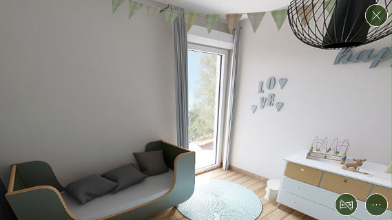
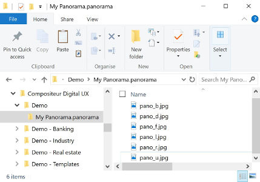

# Panorama : 360° view - first person

## Summary
* [Description](#description)
* [Actions within Compositeur Digital UX](#actions-within-compositeur-digital-ux)
* [Content extension](#content-extension)
* [Create a panorama](#create-a-panorama)
* [Create a tour](#create-a-tour)
* [Projection types](#projection-types)
   * [Spherical projection](#spherical-projection)
   * [Cube projection](#cube-projection)
   * [Video projection](#video-projection)
* [Download a sample](#download-a-sample)

## Description

This content type allows you to display a 360° view of a scene (e.g. landscapes, interior views...) using specific images.

To interact with a Panorama, press the navigation button at the center of the item : it starts the navigation mode.

This content type supports [krpano tour](https://krpano.com/tours/weingut/). It allows the user to navigate in a virtual space and explore various scenes clicking on hotspots to move from one scene to another one.

In navigation mode, slide your finger on the item to rotate the camera and see all the scene. If you don't touch the panorama for 10 seconds in navigation mode, it will automatically disable the navigation mode and your item will behave normally when you touch it.
You can also press the `end navigation` button (next to the action button) to end navigation.

When a hotspot is available, tapping on it will drive you to the next scene. 

## Actions within Compositeur Digital UX

Panorama items support the following action. To have a complete overview of each action, [see the section Actions](actions.md)

**Actions menu**

| Annotate | Capture  | Duplicate | Save as  | Selection | Share    | 
|:--------:|:--------:|:---------:|:--------:|:---------:|:--------:|
| &#x2716; | &#x2714; | &#x2714;  | &#x2716; | &#x2714;  | &#x2716; |

**Interaction with the item**

| Navigation Mode | Hotspot Selection |
|:---------------:|:------------------|
| &#x2714;        | &#x2714;          |

## Content extension

To use a panorama, put the images to render in a folder, and add the extension `.panorama` at the end of the name of your folder.
Inside your panorama, only use files that end with `.jpeg`, `.jpg`, `.png`, or `.xml` to include krpano tours.

## Create a panorama

1. In your environment folder, create a folder named `<Name of your panorama>.panorama` (e.g. `My Panorama.panorama`).
1. Drag and drop all the files which are composing your panorama in this folder.
1. (Optional) Add an image (`.jpg` or `.png`) named `_preview` to change the preview.

## Create a tour

1. In your environment folder, create a folder named `<Name of your tour>.panorama` (e.g. `My Tour.panorama`).
1. Drag and drop all files which are composing your tour in this folder. These files must include a file named `_tour.xml`. This file includes all the descriptions of the various scenes and hotspots which are composing your tour. 
The graphical resources coming with your tour should also be pasted in your `panorama` folder. Their path should be the same as the one described by your krpano file. 
1. (Optional) You can customize the look of your hotspots. Add an image (`.png`) named `_hotspot.png` to change the look of the hotspots.
1. (Optional) Add an image (`.jpg` or `.png`) named `_preview` to change the preview.

## Projection types

Two types of projection are supported.

### Spherical projection

Place a single image with the spherical projection of the scene in the folder. The name of the file does not matter, just keep in mind that this file cannot be named `_background` or `_preview`.

**Important** : Do not place any other images in this folder (except one `_preview` file, if you want to change the preview).

### Cube projection

Place 6 images, corresponding to the six faces of your cube in the folder. Keep in mind that none of the files should be named `_background` or `_preview`.

> Note : The default preview displayed, if a `_preview` file is not placed in the folder, will be the front face of the cube.

**Naming** : your files should respect the following conventions:
   * *up* : named "u" or matches "\_u\_", "\_u", "u\_", "up" (e.g. `u.jpg`, `pano_u.jpg`, `up.jpg`)
   * *down* : named "d" or matches "\_d\_", "\_d", "d\_", "down" (e.g. `d.jpg`, `pano_d.jpg`, `down.jpg`)
   * *front* : named "f" or matches "\_f\_", "\_f", "f\_", "front" (e.g. `f.jpg`, `pano_f.jpg`, `front.jpg`)
   * *back* : named "b" or matches "\_b\_", "\_b", "b\_", "back" (e.g. `b.jpg`, `pano_b.jpg`, `back.jpg`)
   * *left* : named "l" or matches "\_l\_", "\_l", "l\_", "left" (e.g. `l.jpg`, `pano_left.jpg`, `left.jpg`)
   * *right* : named "r" or matches "\_r\_", "\_r", "r\_", "right" (e.g. `r.jpg`, `pano_r.jpg`, `right.jpg`)

**Important** : Do not place any other images in this folder (except one `_preview` file, or `_hotspot` file if you are creating a tour).

### Video projection

It is possible to navigate in a video if this video is a 360° video. Put your video file inside your `panorama` folder. The name of the file is not important as long as the file has a [video format supported by Compositeur Digital UX](../video.md).

In the video player, to move the camera, hit the `360°` button in the media control bar. 

To stop the navigation, click on the `360°` button again.

## Download a sample

A Demo Universe which contains samples for panorama contents is available, [give it a try!](../Demo-Universe.zip) &#x1f604;

Next : [Quiz (Compositeur Digital UX format)](quiz.md)

[Back to Supported Content](index.md)

