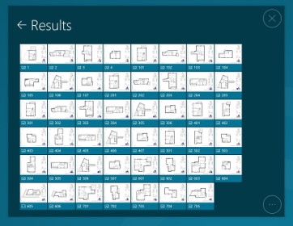
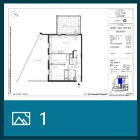
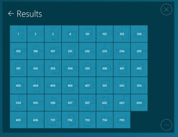
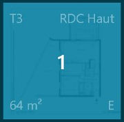

# Search Interface

This content type allows you to display a search interface for any item (e.g. apartments, plans, cars, ect) that is placed in the same folder.

## Summary
* [Actions within Compositeur Digital UX](#actions-within-compositeur-digital-ux)
* [Content extension](#content-extension)
  * [Spreadsheet : \_list.csv or \_catalog.csv](#spreadsheet--_listcsv-or-_catalogcsv)
  * [`.search` Extension](#search-extension)
  * [`.filters` Extension](#filters-extension)
  * [`.apartments` Extension](#apartments-extension)
* [Create a search interface](#create-a-search-interface)
* [Download a sample](#download-a-sample)

## Actions within Compositeur Digital UX

Search interfaces support the following action. To have a complete overview of each action, [see the section Actions](actions.md)

**Actions menu**

| Annotate | Capture  | Duplicate | Save as  | Selection | Share    |
|:--------:|:--------:|:---------:|:--------:|:---------:|:--------:|
| &#x2716; | &#x2716; | &#x2716;  | &#x2716; | &#x2714;  | &#x2716; |

**Interaction with the item**

| Filters  | Launch items |
|:--------:|:------------:|
| &#x2714; | &#x2714;     | 

## Content extension

To use a search interface, put all the items you need in a folder, and add the extension `.filters` or `.search` or `.apartments` (for real estate needs) at the end of the name of your folder.

Inside your folder, provide a file named `_list.csv` or `_catalog.csv`. There are no differences between these files, but only these names are supported by Compositeur Digital UX.

### Spreadsheet : \_list.csv or \_catalog.csv

This file contains the set of data which will be used for search criteria. This document is a `.csv` file, using `;` as delimiters. It can be edited using Microsoft Excel. 

**Format**

The first line of the spreadsheet represents the *type of criteria*. Select one amongst the following:

| Keys          | Description                                                                                           |
|:--------------|:------------------------------------------------------------------------------------------------------|
| `id`          | **MANDATORY**. This columun must match with a document name in the folder. It will not be displayed as a criteria but will be used to open a result.                                                                                          |
| `double`      | Criteria to display a decimal number.                                                                 |
| `float`       | Criteria to display a decimal number                                                                  |
| `int`         | Criteria to select an integer.                                                                        |
| `multiple`    | Criteria for multiple selection.                                                                      |
| `price`       | Represents a price. Do not specify unit.                                                              |
| `single`      | Criteria for single choice.                                                                           |
| `string`      | Criteria for multiple selection.                                                                      |
| `surface`     | Represents a surface. Type in "m²". Do not specify unit.                                              |
| `floor`       | Floor level (real estate use case).                                                                   |
| `orientation` | Criteria to select an orientation (e.g. "North", "South"... real estate use case).                    |
| `state`       | Criteria to select a state (real estate use case).                                                    |
| `type`        | Number of room (real estate use case).                                                                |
| `visual`      | Criteria to select a visual (real estate use case).                                                   |

The second line of the spreadsheet represents the criteria name, which will be displayed in the search interface.

Starting from the third line, each line represent an item that can be searched using the search interface.

### `.search` Extension

The `.search` extension is useful to display a search interface that is not dynamic. The user is selecting all the filters she wants to apply, and then press a button labelled "Search". The search results are computed and the items matching the criteria are displayed.

If the user presses the back arrow at the top left corner of the view, the filters can be changed.

 

The design of a result item corresponds to a thumbnail of the item, and its name.

### `.filters` Extension

The `.filters` extension provides a dynamic search interface. Each time the user is changing a filter, the results displayed on the right side of the view are automatically updated to match the current selection.

The design of a result item corresponds to a thumbnail of the item, and its name.

### `.apartments` Extension

The `.apartments` extension uses the same interface as the `.search` extension. The only difference is how the result looks.

The design of a result item indicates various information about the item : surface, orientation, type, floor, ect...

 

## Create a search interface

1. In your environment, create a folder named `<Name of your search interface>.search` or `<Name of your search interface>.filters` or `<Name of your search interface>.apartments` depending of the type of view you prefer (e.g. `Search.search`, or `Search.filters`).
1. Inside this folder, create a file called `_list.csv` (or `_catalog.csv`). 
1. Fill the spreadsheet with the criteria you want, and describe your item.
1. For each item that belongs to the column `id` of your `_list.csv` (or `_catalog.csv`), add an item inside your search folder (image, pdf, ect...)

## Download a sample

A Demo Universe which contains samples for search interfaces is available, [give it a try!](../Demo-Universe.zip) &#x1f604;

Next : [Sequences : Pre-rendered 360° view (orbital, Compositeur Digital UX format)](sequences.md)

[Back to Supported Content](index.md)
