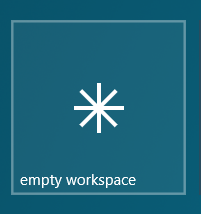

# Browsing on Compositeur Digital UX 

## Start Page - Environments

The Compositeur Digital UX start page presents all the environments available. 

1. Depending on your device type, on the top left corner you can connect to your Compositeur Digital account ([see section Compositeur Digital UX account](account.md)).
1. A tab displays all the environments available. 
1. At the bottom of the page, a navigation bar offers you to access the settings of the application, and if you don't own a full version of Compositeur Digital UX, to buy one.

If you don't have any environments when starting Compositeur Digital UX, a pop up will ask you to install the Demo Content. 

You can also start an empty environments by clicking on:
.

## Start Page - Projects

Clicking on "Open" drives you to the projects you have worked on. All the projects that you have saved will appear here.

1. These projects can be sorted by creation date, last access date, name, or environment type.
2. Clicking on "New" drives you to your environments pages.

## Working Page

### Overview

The working page is divided into 3 area:

1. The workspace : a collaborative area, to display, manipulate and edit content.
1. A dock to browse and access your content.
1. The menu button, useful to : 
   1. Add notes, blanksheets or templates.
   1. Change the ink color of your pen.
   1. Access settings of your project.
   1. Import / paste new documents
   1. Share your work
   1. Save your project
   1. Visualize all your documents : favorites, imported documents, history, environment.
  
### Opening a document

1. On the dock, tap on the folder to open it.
1. In the folder view, tap on any document to display it.

### Manipulating a document

#### Gestures

Compositeur Digital UX has been designed to be used with tactile interactions and gestures.
The following gestures are supported:
1. Move.
1. Pinch / Spread to zoom in /out.
1. Rotation

#### Closing a document

A document can be closed by tapping on the cross at the top right corner.

You can also close a document by throwing it away on the edges of your screen. If you apply enough strength, the document will be removed from the workspace. 

**Important** : a document that you have closed is never lost. You can retrieve it inside the History.

Next : [Actions in Compositeur Digital UX](actions.md) 

[Back to Using Compositeur Digital UX](index.md)

