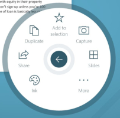
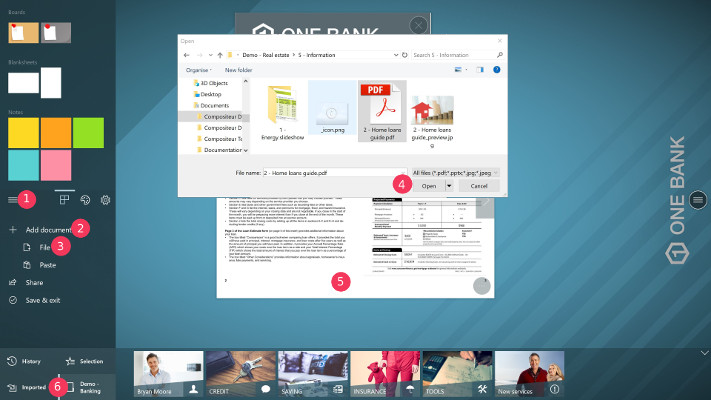
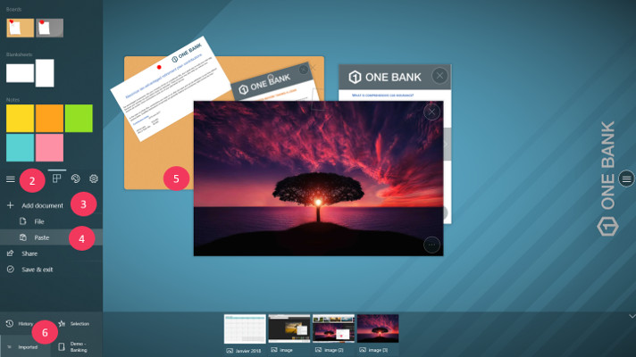
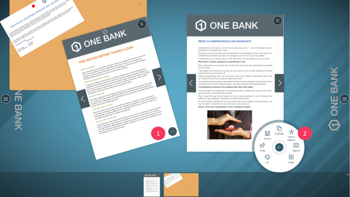
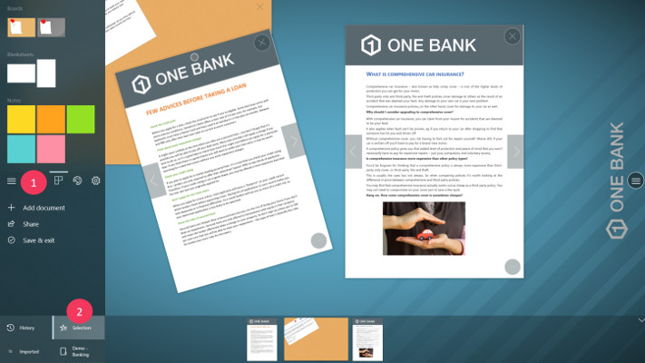
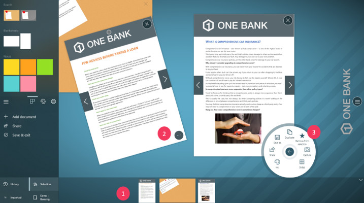
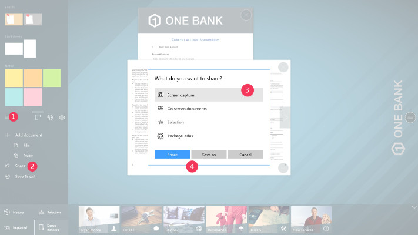

# Workflow

This section highlights the actions you can achieve in a meeting situation using Compositeur Digital UX.

## Summary
* [Beginning of your meeting](#beginning-of-your-meeting)
* [During your meeting](#during-your-meeting)
  * [Open your document](#open-your-document)
  * [Annotate your document](#annotate-your-document)
  * [Use blanksheets and notes](#use-blanksheets-and-notes)
  * [Use templates](#use-templates)
  * [Create a copy of your document](#create-a-copy-of-your-document)
  * [Import a document](#import-a-document)
    * [From your hard drive](#from-your-hard-drive)
    * [Paste an image](#paste-an-image)
  * [Make your selection](#make-your-selection)
    * [Add a document](#add-a-document)
    * [Check your current selection](#check-your-current-selection)
    * [Remove your document](#remove-your-selection)
  * [Check your history to retrieve documents](#check-your-history-to-retrieve-documents)
* [End of your meeting](#end-of-your-meeting)
  * [Share your work](#share-your-work)
  * [Close the project](#close-the-project)

## Beginning of your meeting

Your Compositeur Digital UX is started, waiting for a [universe to be opened](presentation.md#universes). 
Three situations are available here : 
1. Either you already have created a universe that contains all your important documents which will be useful during your meeting and you have never worked on this universe;
1. You have a universe, and you already have saved [projects](presentation.md#projects) out of it;
1. Or you just need an empty space to start talking about your meeting goals.

Depending on your situation, open your universe, project or start an empty workspace.

Your meeting can start now!

## During your meeting

During your presentation, you'll face some situations where you'll need to interact with the workspace. This section summarizes all the actions you can do.

### Open your document

During your presentation, you'll probably need to work on documents. If your universe includes documents, you can [open a document](presentation.md#open-a-document) using the dock area:

1. If the dock is not visible, tap on the navigation bar at the bottom of the screen. 
1. If your document is already on screen, it will arrive under your finger.

If your dock is empty, make sure the dock is displaying your universe documents:

1. Tap on the main menu button.
1. Tap on the button which contains your universe's name.
1. All the documents which belong to your universe are now displayed in the dock.

### Annotate your document

The workspace allows you to annotate a document, it requires to have a pencil recognized by your device. Simply use the pencil on your document. You can change the color of the ink, and the type of the ink as well.

 

1. Tap on the action button of your document.
1. Tap on `Ink`.
1. Select the color and the ink type you want.

> Note : Your pencil device should have an "eraser" that you can use to erase the ink strokes you have been writing.

### Use blanksheets and notes

Do you need empty papers to ideate? No problem, we have that for you!

Compositeur Digital UX lets you work with blank documents and notes to stimulates your ideation process.
To add one of these documents to your project:

1. Tap on the main button menu.
1. Browse the documents area to select the type of document you want to add.
1. Drag and drop the document in the workspace, or just tap on it.

### Use templates 

Templates can be very useful, depending on your meeting type (todo list, models, ect...). Compositeur Digital UX supports [template edition and creation](../organise_content/supported_content/templates.md)

To add a template to your workspace:

1. Tap on the main button menu.
1. Browse the documents area to select the template you want to add.
1. Drag and drop the template in the workspace, or just tap on it.

### Create a copy of your document

At some point, you might need to compare several versions of the same file. To do it, just make a copy of your document using the `Duplicate` action.
Using your pencil, you can [annotate your document](#annotate-your-document) and write the version number (e.g. "V1", "V2", ect...).

> Note : When your document is duplicated, all the annotations and documents pasted on it are duplicated too.

### Create a capture of your document

You can create a capture of a document to add annotations on it. For example, videos do not support annotations. If you want to edit a frame of the video, you can make a capture of the frame. 
Use the action menu of your item, and tap on `Capture`.

### Import a document

During your meeting, you might need to add documents which are not a part of your universes. To do so, you have two different ways:

#### From your hard drive

1. Tap on the main menu button.
1. Tap on `Add document`.
1. Tap on `File`
1. Using the filepicker, select the document you want to add.
1. Your document is now a part of your project.
1. You can retrieve it in the `Imported` documents.

#### Paste an image

You can import images from outside Compositeur Digital UX. Simply copy an image to your clipboard( right click, copy).

1. Copy an image to your clipboard. 
1. Tap on the main menu button.
1. Tap on `Add document`.
1. Tap on `Paste`.
1. The image is now a part of your project.
1. You can retrieve it in the `Imported` documents.

### Make your selection

When you have applied key changes to a specific document, or if the document itselft is very important, you can add it to your selection. The selection allows you to save all the documents which matter to your project's goals, and to share them easily.

####  Add a document

To add an item to your selection:
1. Tap on the action button of the item (the item must be in the workspace).
1. Tap on `Add to selection`.

#### Check your current selection

All the items belonging to your selection can be retrieved from the dock area.

1. Tap on the main button menu.
1. Tap on `Selection` at the bottom of the menu.

Your selection appears on the dock.

#### Remove documents

To remove a document from the selection, you have two options.

##### Using the item action menu

1. (Optional if the item is already in the workspace) Tap on the item in the selection to open it. 
1. Tap on the actions button of the item (bottom right corner).
1. Tap on `Remove from selection`.

##### Using swipe gestures

1. Perform a swipe on the item, from the top to the bottom of the item. The item will be removed.

### Chek your history to retrieve documents

If you have removed a document from the workspace, keep in mind that this document is not lost! It can be retrieved from your history.

1. Tap on the main menu button.
1. Tap on `History` at the bottom of the menu.
1. The history is now accesible from the dock.

> Note : you can remove a document from the history definitely. To do so:
> 
> 
>
> 1. Perform a swipe on the item, from the top to the bottom of the item. The item will be removed.

## End of your meeting

Now, your meeting is over, and you want people you have been working on to go with the important documents you have manipulated together.

### Share your work.

You need to share the current project with your colleagues, or with your client, various options are offered: 
* You can share a single document.
* You can share your selection.
* You can share the documents which are opened on screen.
* You can share a screenshot of your workspace.
* You can share a copy of your project. This copy can be opened using Compositeur Digital UX.

You can send the documents by email, or save a local copy of the document on your hard drive or usb stick.

1. Tap on the main menu button.
1. Tap on `Share`
1. Select the document you want to share.
1. Select where you want to send the document (i.e. email or hard drive).

### Close the project

Your documents were shared, you can leave the workspace. If you were working on a universe for the very first time, a prompt will ask you if you want to save your work. Then, you will go back to the [Universes page](presentation.md#universes)

To quit a project:
1. Tap on the main menu button.
1. Tap on `Save & exit`.
1. (Optional) If you are working on a project for the very first time, a prompt will ask you if you want to save your work. If not, the project will be saved automatically.

[Next : Use Cases : Recommendations](use_cases.md)

[Back to User Guide](index.md)

