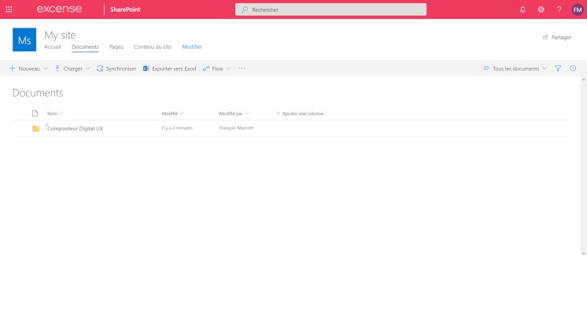
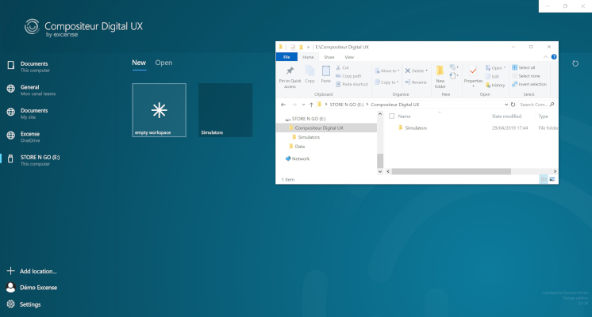
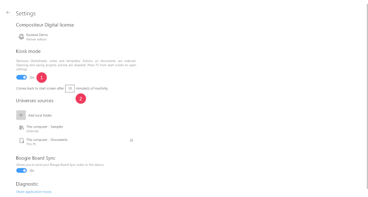
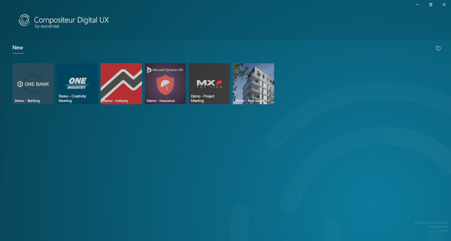
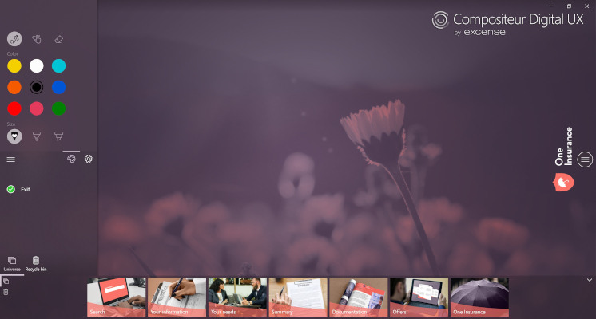
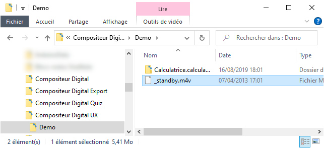

# Guide administratif

Suivez ce guide pour savoir comment gérer les données administratives de votre Compositeur Digital UX : licence, connexion Office365, dossiers Compositeur Digital...

## Résumé

* [Licence Compositeur Digital UX](#licence-compositeur-digital-ux)
  * [Identification](#identification)
  * [Déconnexion](#déconnexion)
* [Compte Office365](#compte-Office365)
  * [Se connecter à Office365](#se-connecter-à-office365)
  * [Se déconnecter d'Office365](#se-déconnecter-doffice365)
  * [Microsoft Teams](#microsoft-teams)
  * [Sites SharePoint](#sites-sharepoint)
* [Ajouter des dossiers locaux](#ajouter-dossiers-locaux)
* [clés USB](#clés-usb)
* [Mode kiosque](#mode-kiosque)

## Licence Compositeur Digital UX

Compositeur Digital UX offre un mode d'essai avec un ensemble limité de fonctionnalités. 

Si vous disposez d'une licence Compositeur Digital, veuillez suivre la description ci-dessous pour vous connecter à partir de l'application. 

Vous pouvez également créer un compte [ici](http://www.compositeurdigital.com/Account/Register) ou [nous contacter](mailto:contact@excense.fr) pour acheter une licence.

### Identification

1. Sur la page de démarrage de l'application, cliquez sur le bouton 'Paramètres'.

2. Sur la page des paramètres, cliquez sur "Ajouter une licence", sous "Compositeur Digital license".
1. Entrez votre nom d'utilisateur et votre mot de passe et cliquez sur "Connexion".
1. Vous êtes connecté ! Votre nom et votre type de licence apparaissent sous "Compositeur Digital license". 

> **Note** : L'appareil enregistrera vos identifiants. Le Compositeur Digital UX utilisera le dernier compte connecté chaque fois que vous démarrerez une nouvelle session. Si vous avez installé Compositeur Digital UX sur un appareil partagé, comme un Microsoft Surface Hub, une fois que vous avez associé une licence de Compositeur Digital à l'appareil, vous ne pourrez pas retirer la licence à moins de [contacter notre équipe d'assistance](mailto:support@excense.fr)

### Déconnexion

À tout moment, vous pouvez décider librement de vous déconnecter.

1. Sur la page de démarrage de l'application, cliquez sur le bouton 'Paramètres'.
1. Sur la page des paramètres, cliquez sur votre nom sous 'Compositeur Digital license', puis cliquez sur ' Se déconnecter '.

## Compte Office365

Le Compositeur Digital UX vous permet de vous connecter directement à votre tenant Office365. Ainsi, vous pouvez diffuser en continu du contenu de vos bibliothèques SharePoint ou des canaux Microsoft Teams et travailler sur un appareil où vos documents ne sont pas téléchargés.

> **Note** : Cette façon d'accéder à vos documents nécessite que vous ayez une connexion internet disponible à chaque fois que vous demandez votre univers en streaming.

### Se connecter à Office365

1. Sur la page de démarrage de l'application, cliquez sur le bouton 'Se connecter...'. 
1. Suivez les instructions d'ouverture de session d'Office365.
1. Vous êtes connecté.

### Se déconnecter de Office365

1. Sur la page de démarrage de l'application, cliquez sur votre compte Office 365.
1. Cliquez sur 'Se déconnecter'.

### Microsoft Teams

Une fois que votre compte Office365 a été ajouté, vous pouvez accéder au contenu de vos Channels Microsoft Teams. Pour ce faire, vous devez créer un dossier 'Compositeur Digital UX' à l'intérieur de votre Channel. 

Dans la capture d'écran ci-dessus, j'ai une équipe appelée 'Mon canal teams', avec un Channel appelé 'Général'. Dans les fichiers du Channel 'Général', j'ai créé un dossier 'Compositeur Digital UX'. Ce dossier contient des univers. 

Depuis mon Compositeur Digital UX, je peux diffuser cette bibliothèque en streaming.

> **Note** : Votre Channel doit contenir un dossier `Compositeur Digital UX` à la racine.

1. Sur la page de démarrage de l'application, cliquez sur votre "Ajouter un emplacement...".
1. Cliquez sur "Teams ou bibliothèque SharePoint".

3. Entrez le nom de vos équipes.
1. Choisissez le canal Teams parmi les choix proposés
1. Cliquez sur 'Ajouter'.

6. La source a été ajoutée à votre liste de sources. 

### Sites SharePoint

Prenons un autre exemple. J'ai un site SharePoint appelé 'Mon site'. Sous ce site, j'ai une bibliothèque de 'Documents'. Dans cette bibliothèque, j'ai un dossier appelé 'Compositeur Digital UX', qui contient des univers. 

> **Note : La bibliothèque de votre site doit contenir un dossier `Compositeur Digital UX` à sa racine.

1. Sur la page de démarrage de l'application, cliquez sur votre 'Ajouter un emplacement...'.
1. Cliquez sur `Teams ou la bibliothèque SharePoint`.
1. Entrez le nom de votre site SharePoint.
1. Choisissez le nom de la bibliothèque qui contient un dossier `Compositeur Digital UX`.
1. Cliquez sur 'Ajouter'.
1. La source a été ajoutée à votre liste de sources. 

## Ajouter des dossiers locaux

Par défaut, vos univers sont tous stockés dans un seul dossier de votre ordinateur personnel. Ce dossier est `<HD>\<nom d'utilisateur>\Documents\Compositeur Digital UX`.

Selon la configuration de votre entreprise, vous pouvez avoir accès à un système de stockage partagé (par exemple Microsoft SharePoint, Google Drive, Dropbox, etc.). Vous pouvez ajouter ces dossiers en tant que dossiers Compositeur Digital. Cela signifie que lorsque vous démarrez Compositeur Digital UX, le système vérifie s'il y a des univers dans tous les dossiers que vous avez définis.

L'utilisation d'un système de stockage partagé est très pratique pour partager vos univers avec toutes les personnes qui ont besoin d'utiliser Compositeur Digital UX.

Pour ajouter des dossiers Compositeur Digital UX existants :

1. Sur la page de démarrage de l'application, cliquez sur 'Ajouter un emplacement...".
1. Cliquez sur 'Dossier local'.
1. Choisissez votre dossier.
1. C'est tout &#x1F604 ;

## Clés USB

Lorsque vous connectez une clé USB à votre appareil, le Compositeur Digital UX vérifie automatiquement si la clé USB contient un dossier 'Compositeur Digital UX' à sa racine. Si un tel dossier existe, une source sera automatiquement ajoutée.

## Mode kiosque

Un mode kiosque est disponible dans l'application. Ce mode est adapté aux appareils qui sont utilisés comme terminaux publics. 

Lorsque le mode kiosque est activé, il réduit les actions qui peuvent être déclenchées dans le Compositeur Digital UX : l'utilisateur ne peut ouvrir qu'un univers et annoter des documents. L'enregistrement est désactivé, ainsi que les actions de partage. Il n'est pas possible d'importer des documents, ni de créer une sélection. Les feuilles blanches et les notes ne sont pas disponibles.  

### Configuration du mode kiosque

Le mode kiosque peut être activé ou désactivé à partir du menu des paramètres. Sur la page d'accueil, cliquez sur 'Paramètres' ou appuyez sur 'F5'.

1. Activez ou désactivez le mode kiosque.
2. Après la période d'inactivité spécifiée, l'application se réinitialisera et reviendra à la page de démarrage. Voir ci-dessous pour configurer une [vidéo de standby](#standby).

La page de démarrage présente une série d'actions réduite. Une seule source est visible, et la vue des projets n'est pas disponible. 

L'espace de travail dispose d'un ensemble limité de fonctions. Le menu latéral vous permet de changer d'encre ou de quitter l'espace de travail. La sélection n'est pas disponible, et les fonctions d'importation sont également désactivées. 

### Standby 

Après la période d'inactivité spécifiée, l'application peut lire une vidéo en plein écran avant de revenir à la page de démarrage.
La vidéo sera lue en boucle jusqu'à ce que les utilisateurs interagissent avec l'application.

Configurez une seule vidéo en nommant le fichier `_standby` (par exemple : `_standby.mp4`) ou une séquence de plusieurs vidéos en créant un dossier nommé `_standby` contenant des fichiers vidéo. 

- Lors de la réinitialisation à partir de la page de démarrage, la ou les vidéos trouvées dans l'emplacement actuel seront utilisées.

    
- Lors de la réinitialisation à partir de l'espace de travail, la ou les vidéos de l'univers actuel seront utilisées si elles existent, sinon la ou les vidéos de l'emplacement de l'univers seront utilisées.

    

[Retour à la documentation](../index.md)
