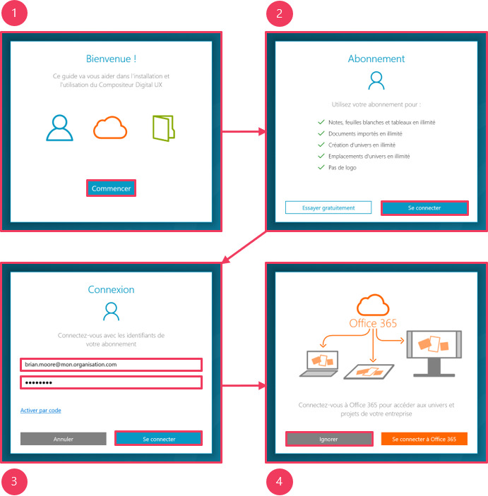

# Aide-mémoire - usage immobilier

Dans cet aide-mémoire, retrouvez l'intégralité des fonctionnalités essentielles à l'usage du Compositeur Digital dans le secteur immobilier.  

## Sommaire

* [Contenus supportés](#contenus-supportes)
* [Démarrage du Compositeur Digital](#démarrage-du-compositeur-digital)
* [Utilisation du Mode Diaporama](#utilisation-du-mode-diaporama)
* [Utilisation de la fonctionnalité Rotation](#utilisation-de-la-fonctionnalité-rotation)
* [Utilisation de la fonctionnalité Scotch](#utilisation-de-la-fonctionnalité-scotch)
* [Annotation des documents](#annotation-des-documents)
* [Utilisation de la fonctionnalité Rotation](#utilisation-de-la-fonctionnalité-rotation)
* [Enregistrement d'un projet](#enregistrement-d'-un-projet)
* [Partage d'un projet](#partage-d'-un-projet)  
  

## Contenus supportés

Tous les contenus de base sont supportés nativement par le Compositeur Digital : 
* pdf, image, powerpoint
* vidéo,audio  

Dans l'immobilier, des contenus spécifiques sont également intégrés et utilisables : 
* [visite virtuelle](http://doc.compositeurdigital.com/UX/en/organise_content/supported_content/panorama.html)
! [visite virtuelle](/UX/en/img/content_panorama_start.JPG)
* [moteur de recherche](http://doc.compositeurdigital.com/UX/en/organise_content/supported_content/search.html)
! [moteur de recherche](/UX/en/img/content_search.JPG)
* [maquette orbitale 360°](http://doc.compositeurdigital.com/UX/en/organise_content/supported_content/sequences.html)
! [maquette orbitale 360°](/UX/en/img/content_sequence_hotspots.JPG)
* [fiche produit](http://doc.compositeurdigital.com/UX/en/organise_content/supported_content/productsheet.html)
! [fiche produit](/UX/en/img/content_product_sheet.JPG)
* [page web intégrée](http://doc.compositeurdigital.com/UX/en/organise_content/supported_content/web_page.html)
! [page web intégrée](/UX/en/img/content_web_page_start.JPG)
  

## Démarrage du Compositeur Digital

**Objectif : Commencer à utiliser le Compositeur Digital en suivant le tuoriel de première utilisation**

  

## Utilisation du mode Diaporama

**Objectif : Affichage de l'ensemble des slides composant une présentation, de l'ensemble des images d'un diaporama...**

<ol>

  <li>Ouverture du menu relatif au document</li>
  <li>Sélection du mode <code>Diaporama</code></li> 

  <li>Sélection d’une page ou d’un slide à afficher</li> 

  <li>Mode d'extraction des pages</li>
  <li>Choix des pages à extraire</li>
</ol>  

## Utilisation de la fonctionnalité Rotation

**Objectif : Permet la manipulation et la rotation des contenus de manière totalement libre, idéal pour le face à face**

<ol>

  <li>Ouverture du menu latéral</li>
  <li>Accéder à l'onglet <code>Réglages</code></li>
  <li>Activer <code>Rotation des documents</code></li>
</ol>  

## Utilisation de la fonctionnalité Scotch

**Objectif : Mettre en relation 2 documents en les assemblant en un seul**

<ol>

  <li>Ouverture du menu latéral</li>
  <li>Accéder à l'onglet <code>Réglages</code></li>
  <li>Activer <code>Adhésif sur les documents</code></li> 

  <li>Superposer deux documents et scotcher</li>
</ol>  

## Annotation des documents

**Objectif : Annoter directement des documents et utiliser des notes auto-collantes**

<ol>

  <li>Ouverture du menu latéral</li>
  <li>Accéder à l'onglet <code>Palette</code></li>
  <li>Changer de taille du stylet</li>
  <li>Passer au mode écriture au stylet</li>
  <li>Passer au mode écriture au doigt</li>
  <li>Passer au mode gomme</li> 

  <li>Accéder à l'onglet <code>Modèles</code></li>
  <li>Choisir une couleur de note</li>
  <li>Ajouter rapidement une autre note</li>
  <li>Accéder aux options relatives à la note</li>
  <li>Supprimer la note</li>
</ol>
  
  
## Enregistrement d'un projet

**Objectif : Enregistrer un projet afin de reprendre le travail précisément là où il a été arrêté**

<ol>

  <li>Ouverture du menu latéral</li>
  <li>Cliquer sur <code>Enregistrer et quitter</code></li> 

  <li>Choix d'enregistrement du projet</li>
  <li>Nommer le projet</li>
  <li>Cliquer sur <code>Enregistrer</code></li> 

  <li>Accéder à l'onglet <code>Ouvrir</code></li>
  <li>Ouverture de votre projet enregistré</li>
</ol>
  

## Partage d'un projet

**Objectif : Partager facilement un compte-rendu de la recontre ou de la réunion**

<ol>

  <li>Ouverture du menu latéral</li>
  <li>Cliquer sur <code>Partager</code></li> 

  <li>Différentes options de partage</li> 

  <li>(optionnel) Fusionner tous les documents en un seul fichier PDF</li>
  <li>Continuer vers la procédure de partage</li>
  <li>Enregistrer une version du projet en local</li> 
  

  <li>Sélectionner l'icône <code>Courrier</code></li>
  <li>Cliquer sur <code>Envoyer</code></li> 

  <li>Choix de l'emplacement de stockage (local ou clé USB)</li>
  <li>Choix du dossier de destination</li>
  <li>Cliquer sur <code>Enregistrer</code></li>
</ol>
