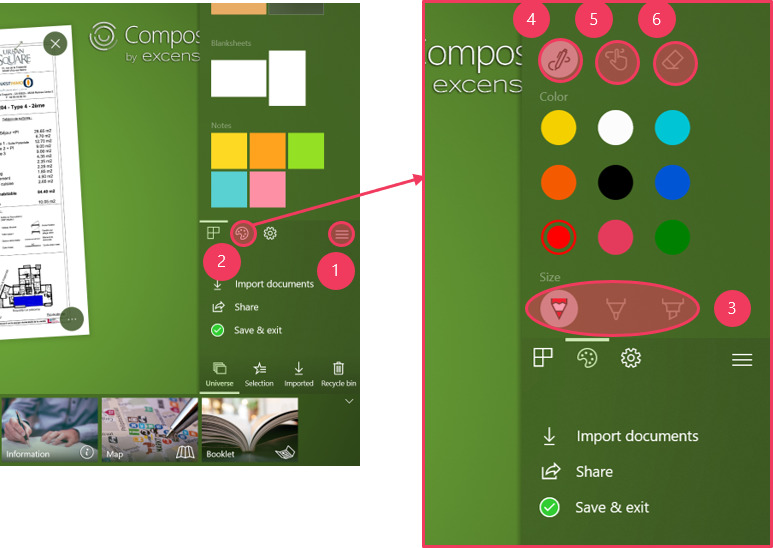
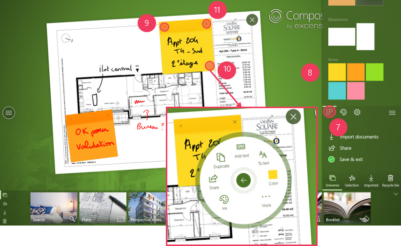
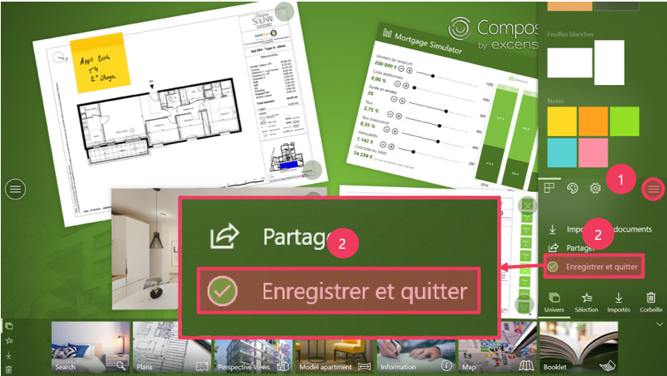
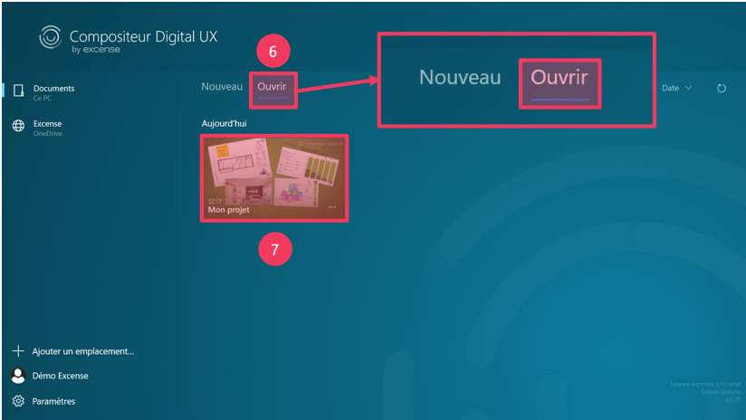
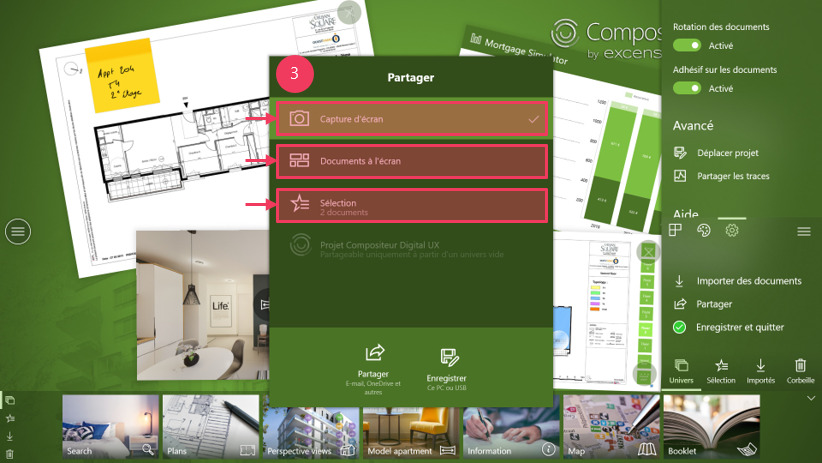
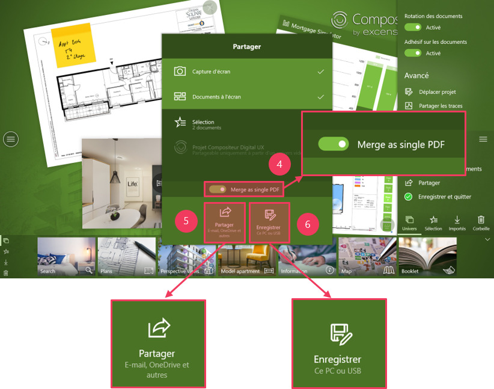
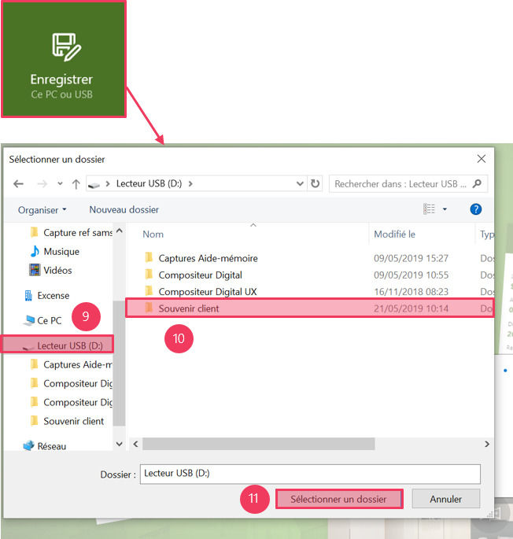

# Aide-mémoire - usage immobilier

Dans cet aide-mémoire, retrouvez l'intégralité des fonctionnalités essentielles à l'usage du Compositeur Digital dans le secteur immobilier.  

## Sommaire

* [Démarrage du Compositeur Digital](#démarrage-du-compositeur-digital)
* [Utilisation du Mode Diaporama](#utilisation-du-mode-diaporama)
* [Utilisation de la fonctionnalité Rotation](#utilisation-de-la-fonctionnalité-rotation)
* [Utilisation de la fonctionnalité Scotch](#utilisation-de-la-fonctionnalité-scotch)
* [Annotation des documents](#annotation-des-documents)
* [Utilisation de la fonctionnalité Rotation](#utilisation-de-la-fonctionnalité-rotation)
* [Enregistrement d'un projet](#enregistrement-d'-un-projet)
* [Partage d'un projet](#partage-d'-un-projet)  

## Démarrage du Compositeur Digital

*Commencez à utiliser le Compositeur Digital en suivant le tuoriel de première utilisation*

  

## Utilisation du mode Diaporama

*Affichage de l'ensemble des slides composant une présentation, de l'ensemble des images d'un diaporama...*

<ol>

   <li>Ouverture du menu relatif au document</li>
  <li>Sélection du mode <code>Diaporama</code></li> 

   <li>Sélection d’une page ou d’un slide à afficher</li> 

   <li>Mode d'extraction des pages</li> 
  <li>Choix des pages à extraire</li>
</ol>  

## Utilisation de la fonctionnalité Rotation

*Permet la manipulation et la rotation des contenus de manière totalement libre, idéal pour le face à face*

<ol>

   <li>Ouverture du menu latéral</li>
  <li>Accéder à l'onglet <code>Réglages</code></li>
  <li>Activer <code>Rotation des documents</code></li>
</ol>  

## Utilisation de la fonctionnalité Scotch

*Mettez en relation 2 documents en les assemblant en un seul*

<ol>

   <li>Ouverture du menu latéral</li>
  <li>Accéder à l'onglet <code>Réglages</code></li>
  <li>Activer <code>Adhésif sur les documents</code></li> 

   <li>Superposer deux documents et scotcher</li>
</ol>  

## Annotation des documents

*Annotez directement vos documents et utilisez des notes auto-collantes*

1. Ouverture du menu latéral
1. Accéder à l'onglet `Palette`
1. Changer de taille du stylet
1. Passer au mode écriture au stylet
1. Passer au mode écriteur au doigt
1. Passer au mode gomme

1. Accéder à l'onglet `Modèles`
1. Choisir une couleur de note
1. Ajouter rapidement une autre note
1. Accéder aux options relatives à la note
1. Supprimer la note  

## Enregistrement d'un projet

*Enregistrez votre projet afin de reprendre votre travail précisément là où vous l'avez arrêté*

1. Ouverture du menu latéral
1. Début de procédure d'enregistrement

1. Choix d'enregistrement du projet
1. Nommer le projet 
1. Validation de l'enregistrement

1. Accéder à l'onglet "Ouvrir" 
1. Ouverture de votre projet enregistré  

## Partage d'un projet

*Partagez facilement un compte-rendu de votre travail ou de votre réunion*

1. Ouverture du menu latéral
1. Cliquer sur `Partager`

1. Différentes options de partage

1. Fusionner tous les documents en un seul fichier PDF
1. Continuer vers la procédure de partage
1. Enregistrer une version du projet en local

1. Sélectionner l'icône `Courrier` 
1. Envoi du mail

1. Choix de l'emplacement de stockage (local ou clé USB)
1. Choix du dossier de destination
1. Valider l'enregistrement
