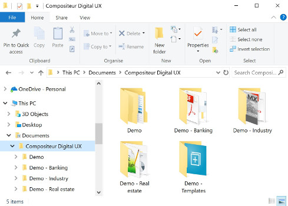
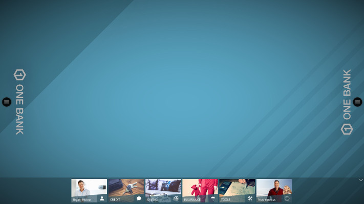
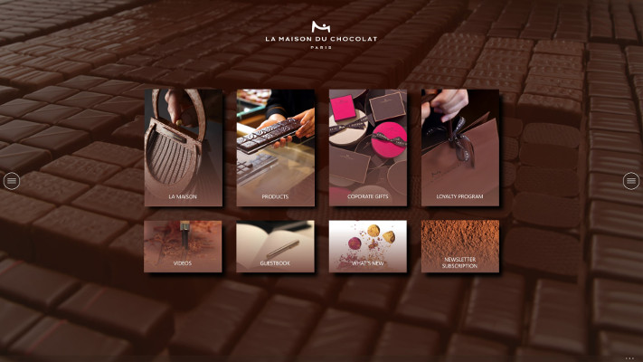
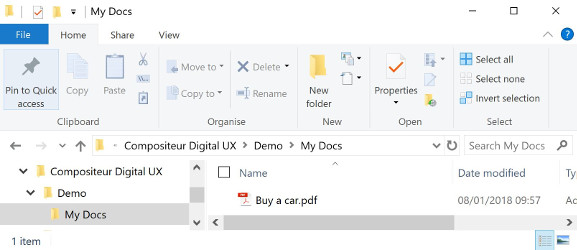
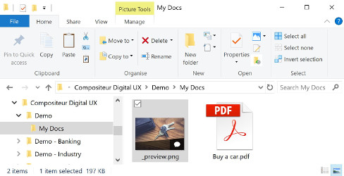
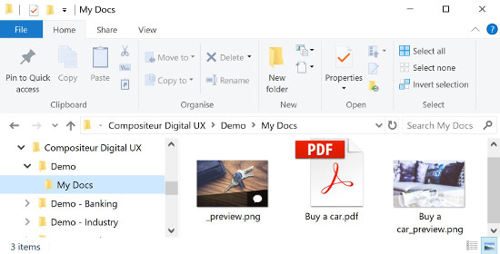
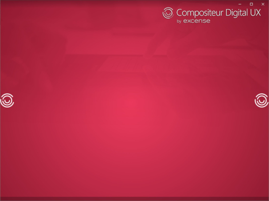

# Créer vos univers

Le Compositeur Digital UX traite les documents stockés dans un endroit spécifique de votre ordinateur. Ces documents peuvent être organisés en dossiers pour faciliter la présentation.

## Résumé
* [Compétences et ressources requises](#Compétences-et-ressources-requises)
* [Extensions de fichiers](#extensions-de-fichiers)
* [Univers](#univers)
* [Fond](#fond)
* [Fond interactif](#fond-interactif)
* [Dossiers](#dossiers)
  * [Fonctionnalité des dossiers cachés](#fonctionnalité-des-dossiers-cachés)
* [Documents](#documents)
* [Ordre de visualisation du contenu](#ordre-de-visualisation-du-contenu)
* [Miniatures](#miniatures)
  * [Miniature dossier ](#miniature-dossier)
  * [Miniature document](#miniature-document)
* [Personnaliser l'espace de travail](#personnaliser-lespace-de-travail)
* [Univers de démonstration](#univers-de-démonstration) 

## Compétences et ressources requises

La préparation d'un univers se fait à l'aide de l'application intégrée d'exploration de fichiers de Microsoft Windows

Vous devez être à l'aise avec : 

- Organisation des dossiers 
- Renommer les fichiers et le dossier
- C'est tout &#x1F601;

## Extensions de fichiers

Compositeur Digital UX utilise l'extension de fichier pour configurer les différents éléments d'un univers.  L'"extension de fichier" indiquant le type de document est généralement un ensemble de 3 à 4 caractères suivant le point dans le nom du fichier :

- Images : par exemple `photo1.jpg`, `photo2.png`.
- Présentation : par exemple `pres1.pptx`, `pres2.pdf`.
- Fichier texte : par exemple `tableau de contenu.txt`.

Par défaut, l'application Windows File explorer cache les extensions de fichiers. Nous vous recommandons vivement de modifier ce paramètre.

## Univers

Techniquement, un univers se matérialise sous la forme d'un dossier sur votre ordinateur. Par défaut, Compositeur Digital UX recherche le contenu situé dans `Documents\Compositeur Digital UX`

Pour créer votre propre univers, vous pouvez dupliquer un univers existant dans l'emplacement par défaut : `Documents\Compositeur Digital UX`.

## Fond

Vous pouvez personnaliser votre univers en changeant l'image de fond. Pour ce faire, il suffit d'ajouter un fichier image (`.png` ou `.jpg`) nommé `_background` dans le dossier de l'univers.

 

### Ratio de manipulation de votre écran

Différents arrière-plans peuvent être définis, adaptés à différents formats d'écran. Par exemple, un fichier nommé `_background3_2` sera sélectionné si l'application est exécutée sur un périphérique qui correspond à un écran 3:2.

Voici une liste de tous les formats d'écran pris en charge.

| Format| Nom du fichier     |
|:-----:|:------------------:|
| 3:2   | `_background3_2`   |
| 4:3   | `_background4_3`   |
| 5:4   | `_background5_4`   |
| 16:9  | `_background16_9`  |
| 16:10 | `_background16_10` |

L'utilisation de différents fichiers de fond, adaptés à différents formats d'écran, vous permet de vous assurer que vous pouvez visualiser votre univers sur n'importe quel écran.

## Fond interactif

Si vous souhaitez avoir un fond interactif, qui contient des hyperliens pour afficher votre contenu, c'est également possible. Préparez un fichier powerpoint, avec une diapositive contenant votre image de fond. Dans cette diapositive, n'oubliez pas de créer des [Hot Spots](../supported_content/powerpoint.md#hot-spots) pour afficher vos menus, ou vos fichiers. Le nom du fichier doit être `_background.pptx`. 

## Dossiers

Vous pouvez organiser vos documents dans des dossiers et des sous-dossiers. 

Le premier niveau de dossiers est affiché dans le Compositeur Digital UX dans le dock situé en bas de la vue de l'univers. 

>### Fonctionnalité des dossiers cachés
>
>Les dossiers dont le nom contient le mot ".content" ne seront pas affichés dans le Compositeur Digital UX.
>Voir [Powerpoints Hot Spots](supported_content/powerpoint.md#hot-spots) pour voir l'utilisation courante de cette fonctionnalité.

## Documents

Il suffit de glisser et de déposer vos documents dans les dossiers et sous-dossiers pour peupler votre univers.

Consultez le Contenu pris en charge pour obtenir une liste exhaustive des types de fichiers pris en charge.

## Ordre de visualisation du contenu

Le Compositeur Digital UX affichera les dossiers et les documents par ordre alphabétique. Vous pouvez toutefois forcer une séquence d'affichage spécifique pour les documents et les dossiers en préfixant le nom du fichier ou du dossier par un numéro. Compositeur Digital UX n'affichera pas les numéros mais organisera les éléments en conséquence.

## Miniatures 

Le compositeur numérique crée automatiquement des miniatures pour tous les documents. Vous pouvez personnaliser la miniature de chaque document ou dossier de votre univers.

### Miniature de dossier 

Si une image miniature n'a pas été définie pour un dossier, le Compositeur Digital créera automatiquement une image miniature basée sur le premier document du dossier.

 

Pour créer une miniature pour un dossier, il suffit de faire glisser et de déposer un fichier image nommé `_preview` (`.png` ou `.jpg`) directement dans le dossier :

 

### Miniature de document

Pour personnaliser l'image miniature d'un document, faites glisser et déposez un fichier image portant le même nom mais avec le suffixe '_preview' dans le même dossier.

 

## Personnaliser l'espace de travail

Il est possible de changer l'icône du menu. Par défaut, nous utilisons une icône de menu "hamburger". Vous pouvez fournir votre propre icône. Il suffit d'ajouter un fichier `.png` nommé `_sidemenuicon.png` à la racine de votre univers.

Vous pouvez également cacher les trois points de la barre du bas lorsque la barre est réduite. Ajoutez un fichier `_meta.txt` avec une ligne `hideBottomBarDots = true`.

## Univers de démonstration

Un univers de démonstration est disponible et peut être [téléchargé ici](../../en/organise_content/Demo-Universe.zip). Une fois téléchargé, dézippez le fichier et placez le contenu dans votre dossier "Compositeur Digital UX". Cet univers de démonstration comprend des exemples pour chaque type de contenu que vous pouvez créer dans le Compositeur Digital UX.

Suivant : [Contenu pris en charge](supported_content/index.md)

[Retour à Organiser le contenu](index.md)
