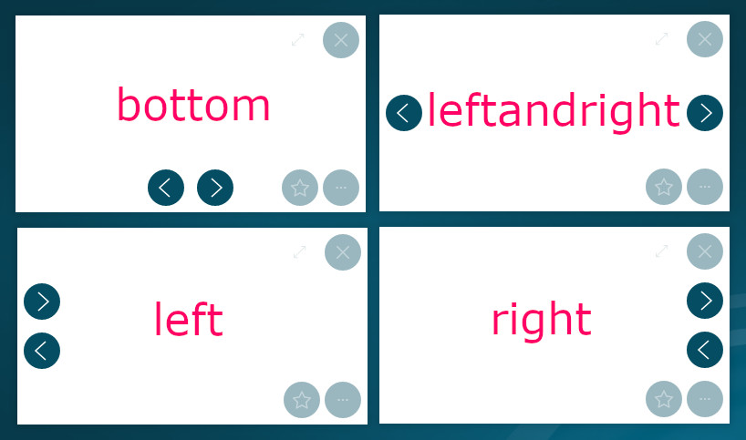

### Diaporama

| Paramètre                         | Type      | Default | Description |
|:--------------------------------- |:----------|:--------|:-|
| `video.controls.position`         | `auto|bottom|left|right|leftandright` | auto   | définit la position ou s'affichent les boutons page suivante/précédente |
| `video.controls.hide`             | `boolean` | false   | cache les boutons page suivante/précédente |

Lorsque la position est paramétré `auto`, la position sera `leftandright` si la rotation des documents est activée, sinon `bottom`.

