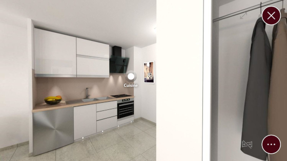
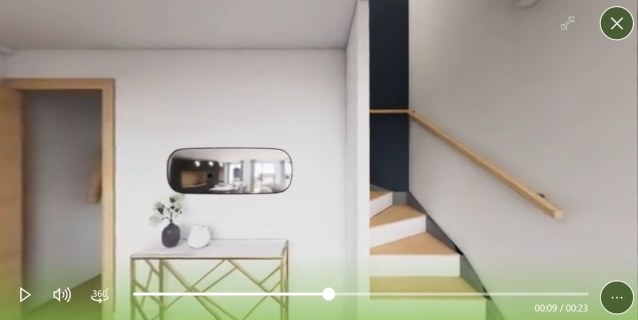
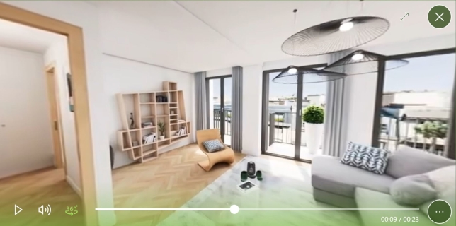

 # Panorama : vue à 360°

## Résumé
* [Description](#description)
* [Actions dans Compositeur Digital UX](#actions-dans-compositeur-digital-ux)
* [Extension de dossier](#extension-de-dossier)
* [Créer un panorama](#créer-un-panorama)
* [Créer une visite virtuelle](#créer-une-visite-virtuelle)
* [Types de projection](#types-de-projection)
   * [Projection sphérique](#projection-sphérique)
   * [Projection en cube](#projection-en-cube)
   * [Projection vidéo](#projection-vidéo)
* [Télécharger un exemple](#télécharger-un-exemple)

## Description

Ce type de contenu permet d'afficher une vue à 360° d'une scène (par exemple, des paysages, des vues intérieures...) en utilisant des images spécifiques.

Pour interagir avec un Panorama, appuyez sur le bouton de navigation au centre de l'élément : cela lance le mode de navigation.

Ce type de contenu prend en charge les format [Krpano](https://krpano.com/tours/weingut/). Il permet à l'utilisateur de naviguer dans un espace virtuel et d'explorer différentes scènes en cliquant sur des zones actives pour passer d'une scène à l'autre.

En mode navigation, faites glisser votre doigt sur l'élément pour faire tourner la caméra et voir toute la scène. Si vous ne touchez pas le panorama pendant 10 secondes en mode de navigation, le mode de navigation sera automatiquement désactivé et votre panorama se comportera normalement lorsque vous le toucherez.
Vous pouvez également appuyer sur le bouton "Fin de la navigation" (à côté du bouton d'action) pour mettre fin à la navigation.

Lorsqu'une zone active est disponible, le fait d'y toucher vous conduira à la scène suivante. 

## Actions dans Compositeur Digital UX

Les éléments du Panorama prennent en charge les actions suivantes. Pour avoir un aperçu complet de chaque action, [voir la section Actions](actions.md)

**Menu des actions**

| Capturer | Dupliquer | Ouvrir dans l'app native | Enregistrer sous | Sélection | Partager | 
|:--------:|:---------:|:------------------------:|:----------------:|:---------:|:--------:|
| &#x2714; | &#x2714;  | &#x2716;                 | &#x2716;         | &#x2714;  | &#x2716; |

**Interaction avec le contenu**

| Déplacer la caméra | Changer de scène | Ouvrir un document |
|:------------------:|:----------------:|:------------------:|
| &#x2714;           | &#x2714;         | &#x2714;           |

## Extension de dossier

Pour utiliser un panorama, placez les images à rendre dans un dossier, et ajoutez l'extension `.panorama` à la fin du nom de votre dossier.
À l'intérieur de votre panorama, n'utilisez que les fichiers qui se terminent par `.jpeg`, `.jpg`, `.png`, ou `.xml` pour inclure les visites de krpano.

## Créer un panorama

1. Dans votre univers, créez un dossier nommé `<Nom de votre panorama>.panorama` (par exemple `Mon Panorama.panorama`).
1. Glissez et déposez dans ce dossier tous les fichiers qui composent votre panorama.
1. (Facultatif) Ajoutez une image (`.jpg` ou `.png`) nommée `_preview` pour changer la vignette.

## Créer une visite virtuelle

1. Dans votre univers, créez un dossier nommé `<Nom de votre visite>.panorama` (par exemple `Ma visite.panorama`).
1. Glissez et déposez dans ce dossier tous les fichiers et sous-dossiers qui composent votre visite. Ces fichiers doivent inclure un fichier nommé `_tour.xml`. Ce fichier contient toutes les descriptions des différentes scènes et zones actives qui composent votre visite. 
Les ressources graphiques fournies avec votre visite doivent également être collées dans votre dossier `panorama`. Leur chemin doit être le même que celui décrit par votre fichier `tour.xml`. 
1. (Facultatif) Vous pouvez personnaliser l'apparence de vos zones actives. Ajoutez une image (`.png`) nommée `_hotspot.png` pour changer l'apparence des zones actives.
1. (Optionnel) Ajoutez une image (`.jpg` ou `.png`) nommée `_preview` pour changer la vignette.

## Types de projection

Trois types de projection sont pris en charge.

### Projection sphérique

Placez une seule image avec la projection sphérique de la scène dans le dossier. Le nom du fichier n'a pas d'importance, gardez juste à l'esprit que ce fichier ne peut pas être nommé `_background` ou `_preview`.

**Important** : Ne placez pas d'autres images dans ce dossier (sauf un fichier `_preview`, si vous voulez changer la vignette).

### Projection en cube

Placez 6 images, correspondant aux six faces de votre cube, dans le dossier. Gardez à l'esprit qu'aucun des fichiers ne doit être nommé `_background` ou `_preview`.

> Note : L'aperçu par défaut affiché, si un fichier `_preview` n'est pas placé dans le dossier, sera la face avant du cube.

**Nom** : vos fichiers doivent respecter les conventions suivantes :
   * *face du haut*: nommée "u" ou correspond à "\_u\_", "\_u", "u\_", "up" (ex. `u.jpg`, `pano_u.jpg`, `up.jpg`)
   * *face du bas*: nommée "d" ou correspond à "\_d\_", "\_d", "d\_", "down" (ex. `d.jpg`, `pano_d.jpg`, `down.jpg`)
   * *face avant*: nommée "f" ou correspond à "\_f\_", "\_f", "f\_", "front" (ex. `f.jpg`, `pano_f.jpg`, `front.jpg`)
   * *face arrière*: nommée "b" ou correspond à "\_b\_", "\_b", "b\_", "back" (ex. `b.jpg`, `pano_b.jpg`, `back.jpg`)
   * *face gauche*: nommée "l" ou correspond à "\_l\_", "\_l", "l\_", "left" (ex. `l.jpg`, `pano_left.jpg`, `left.jpg`)
   * *face droite*: nommée "r" ou correspond à "\_r\_", "\_r", "r\_", "right" (ex. `r.jpg`, `pano_r.jpg`, `right.jpg`)

**Important** : Ne placez pas d'autres images dans ce dossier (sauf un fichier `_preview`, ou un fichier `_hotspot` si vous créez une visite).

### Projection vidéo

Il est possible de naviguer dans une vidéo s'il s'agit d'une vidéo à 360°. Placez votre fichier vidéo 360° dans votre dossier `panorama`. Le nom du fichier n'est pas important tant que le fichier a un [format vidéo pris en charge par Compositeur Digital UX](video.md).

Dans le lecteur vidéo, pour déplacer la caméra, appuyez sur le bouton '360°' de la barre de contrôle du média. 

Pour arrêter la navigation, cliquez à nouveau sur le bouton '360°'.

## Télécharger un exemple

Un univers de démonstration qui contient des exemples de panoramas est disponible, [essayez-le](../Demo-Universe.zip) &#x1f604;

Suivant : [Quizz (format Compositeur Digital UX)](quiz.md)

[Retour aux Contenus pris en charge](index.md)

