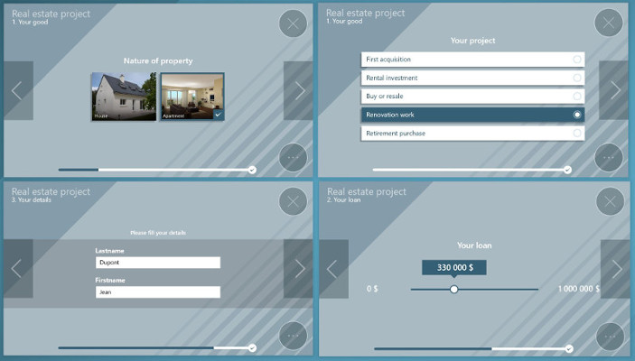
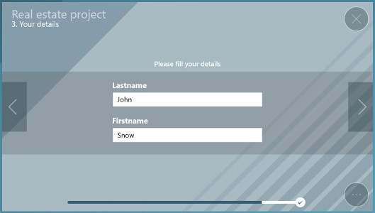
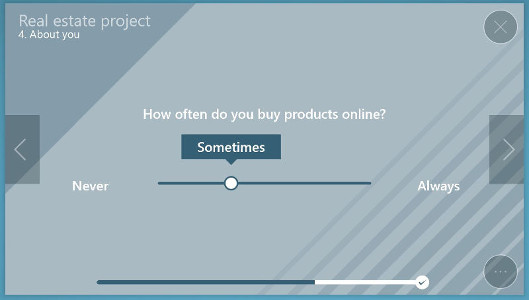
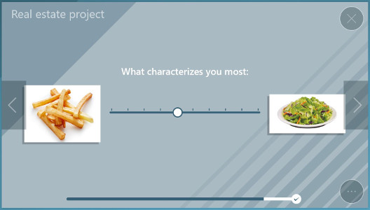
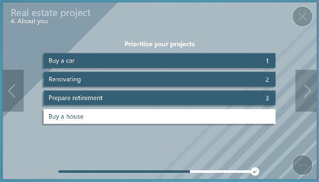
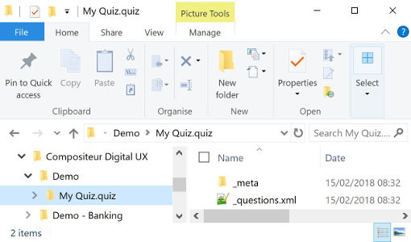

# Quiz

## Résumé 
* [Description](#description)
* [Actions dans Compositeur Digital UX](#actions-dans-compositeur-digital-ux)
* [Extension de dossier](#extension-de-dossier)
* [Questions : questions.xml](#questions--_questionsxml)
   * [Sections](#sections)
   * [Pages](#pages)
   * [Ordre des pages](#ordre-des-pages)
   * [Types de page](#types-de-page)
      * [Question page](#questionpage)
      * [Page](#page)
      * [Info page](#infopage)
      * [Numeric Slider page](#numericsliderpage)
      * [Label Slider page](#labelsliderpage)
      * [Image Slider page](#imagesliderpage)
      * [Document page](#documentpage)
      * [Order page](#orderpage)
      * [Scores Result page](#scoresResultPage)
* [Créer un quiz](#créer-un-quiz)
* [Télécharger un exemple](#télécharger-un-exemple)

## Description

Ce type de contenu vous permet d'afficher des quizz interactifs, qui vous aideront à comprendre les besoins de vos utilisateurs.

   

## Actions dans Compositeur Digital UX

Les quizz prennent en charge les actions suivantes. Pour avoir un aperçu complet de chaque action, [voir la section Actions](actions.md)

**Menu des actions**

| Capturer | Dupliquer | Ouvrir dans l'app native | Enregistrer sous | Sélection | Partager |
|:--------:|:---------:|:------------------------:|:----------------:|:---------:|:--------:|
| &#x2716; | &#x2714;  | &#x2714;                 | &#x2714;         | &#x2714;  | &#x2714; |

**Interaction avec le contenu**

| Ouvrir un document | Naviguer dans le quizz | Questions |
|:------------------:|:----------------------:|:---------:|
| &#x2714;           | &#x2714;               | &#x2714;  |

## Extension de dossier

Pour utiliser un quiz, mettez tous les éléments dont vous avez besoin dans un dossier, et ajoutez l'extension `.quiz` à la fin du nom de votre dossier.

Dans votre dossier, fournissez un fichier appelé `_questions.xml`, et éventuellement un dossier appelé `_meta` qui contiendra toutes les images utilisées dans le quiz.

### <a name="questions"></a>Questions : `_questions.xml`

Le fichier du quiz doit contenir deux parties : `sections` et `pages`.

Structure de fichier générique :
```xml
<quizz>
    <sections>
        liste de sections
    </sections>ˋ
    <pages>
        liste de pages
    </pages>
</quizz>
```

Chaque page décrira une question. Les sections vous permettront de regrouper les pages qui portent le même nom de section. 

#### Sections
Définissez la section afficher le nom dans une balise 'section' et définissez éventuellement l'attribut 'id' si vous avez besoin de créer une
référence à cette section.

```xml
<section id="intro">1. INTRODUCTION</section>
```

#### Pages
Vous pouvez créer un quiz avec différents types de pages, mais toutes les pages doivent avoir les éléments suivants en commun :
 - un attribut `sectionId` qui attribue une page à une section. Le nom de la section apparaîtra en haut de la page.
 - un attribut `id` facultatif à utiliser comme identifiant si une référence à cette page est nécessaire. 
 - un attribut `nextPageId` : référence optionnelle à la page qui doit être affichée ensuite. Si cet attribut n'est pas défini, la page suivante décrite dans le fichier sera utilisée. 

#### Ordre des pages 
La première page décrite dans la liste sera toujours la première page affichée.
La dernière page décrite sera par défaut la dernière page affichée.
Pour forcer une page à terminer le quiz, définissez la valeur de l'attribut `nextPageId` à `end`.

#### Types de page
##### `questionPage`
Ce type permet de créer une question à réponses multiples. Veuillez noter qu'une réponse doit être sélectionnée avant de passer à la page suivante.

Voici les attributs de `questionPage`:

| Attributs       | Description                                                                                            |
|:----------------|:-------------------------------------------------------------------------------------------------------|
| `allowMultiple` | Réglez sur 'vrai' pour permettre la sélection de réponses multiples.			           | 
| `id`            | L'id de la question.                                                                                   |
| `label`         | Texte de la question à afficher. Remplace l'attribut 'visuel'.    				           |
| `sectionId`     | Définit l'id de la section à laquelle appartient la question.                                          |
| `sideVisual`    | Affiche une image en plus de vos questions. L'image doit exister dans le dossier `_meta`.              |
| `visual`        | Nom du fichier image de la question (sans extension). Le fichier doit exister dans le dossier `_meta`. |

Le contenu de la 'questionPage' est la liste des réponses, qui peuvent être de différents types :
 - des réponses textuelles, avec la balise `answer` :
```xml
 <answer>ma réponse</answer>
```
 - des réponses visuelles, avec le tag `imageAnswer`. Définissez l'attribut `visual` au nom de l'image cible (sans extension) dans le dossier `_meta`:
```xml
   <imageAnswer visual="image 2"/>
```
   Vous pouvez éventuellement mettre une légende :
```xml
   <imageAnswer visual="image 2">ma légende</imageAnswer>
```
Il n'est pas possible de mélanger des réponses textuelles et des réponses visuelles dans une même question.

Vous pouvez définir des questions conditionnelles en fonction des réponses fournies par l'utilisateur. Pour ce faire, utilisez l'attribut `nextPageId` pour passer à une page spécifique pour une réponse donnée : 

```xml
<questionPage id="Q1" sectionId="section 2" label="À quelle question souhaitez-vous répondre?">
   <answer>La question suivante</answer>
   <answer nextPageId="Q1">Celle-ci encore</answer>
   <answer nextPageId="Q3">Sauter en une svp</answer>
</questionPage>

<questionPage id="Q2" sectionId="section 3" label="La question suivante">
	...
</questionPage>	
	
<questionPage id="Q3" sectionId="section 3" label="La dernière question">
	...
</questionPage>
```


##### `page`
Décrit une page simple à afficher avec du texte ou des images:

| Attributs       | Description                                                                                            |
|:----------------|:-------------------------------------------------------------------------------------------------------|
| `id`            | L'id de la question.                                                                                   |
| `label`         | Texte de la question à afficher. Remplace l'attribut 'visuel'.	    			           |
| `sectionId`     | Définit l'id de la section à laquelle appartient la question.                                          |
| `visual`        | Nom du fichier image de la question (sans extension). Le fichier doit exister dans le dossier `_meta`. |	 

```xml
<page sectionId="intro" étiquette="C'est un test"/>
```

##### `infoPage`
Affiche un formulaire simple dans lequel l'utilisateur peut saisir des réponses textuelles. 

| Attributs       | Description                                                                                        |
|:----------------|:---------------------------------------------------------------------------------------------------|
| `id`            | L'id de la question.                                                                               |
| `label`         | Titre de la page d'information.  			                                               | 
| `sectionId`     | Définit l'id de la section à laquelle appartient la question.                                      |
| `valueKey`      | Relie cette valeur à une valeur partagée au niveau de votre projet. Voir page [Valeurs partagées](../advanced_setting.md#valeurs partagées). |

Définissez l'attribut `étiquette` des balises `info` pour définir un nom pour la zone de texte.

```xml
<infoPage sectionId="intro" étiquette="Veuillez décliner votre identité">
	<info étiquette="Nom"/>
	<info étiquette="Prénom"/>
</infoPage>
```



##### `numericSliderPage`
Affiche une page avec un seul curseur qui permet à l'utilisateur de choisir une valeur numérique (arrondie) :

| Attributs       | Description                                                                                        |
|:----------------|:---------------------------------------------------------------------------------------------------|
| `default`       | (Facultatif) Valeur présélectionnée.                                                               |
| `format`        | Modifie la façon dont la valeur est affichée.                                                      |
| `id`            | L'id de la question.                                                                               |
| `label`         | Texte de la question à afficher.                                    	    		       |
| `max`           | Valeur maximale sélectionnable.                                                                    |
| `maxLabel`      | (Facultatif) Valeur d'affichage spécifique pour la valeur maximale.                                |  
| `min`           | Valeur minimale sélectionnable.                                                                    |
| `minLabel`      | (Facultatif) Valeur d'affichage spécifique pour la valeur minimale.                                | 
| `sectionId`     | Définit la section id à laquelle la question appartient.                                           |
| `stepSize`      | Différence entre deux pas du curseur.						               |
| `valueKey`      | Reliez cette valeur à une valeur partagée au niveau de votre projet. Voir page [Valeurs partagées](../advanced_setting.md#valeurs partagées). La seule valeur numérique qui peut être partagée est `finance.budget`. Elle définit le prêt hypothécaire en cours. |

Quelques 'formats' possibles :
 - 'N0' : valeur arrondie
 - 'C0' : valeur monétaire arrondie selon le contexte régional actuel (c'est-à-dire en utilisant €, £, $, etc., le cas échéant)

```xml
<numericSliderPage id="fonds" sectionId="section 3" label="Vos fonds disponibles" min="0" max="5000000" stepSize="5000" format="C0" valueKey="finance.budget" />
```


##### `labelSliderPage`
Cela affiche une page avec un curseur avec des valeurs prédéfinies.

| Attributs       | Description                                                                                        |
|:----------------|:---------------------------------------------------------------------------------------------------|
| `id`            | L'id of de la question.                                                                            |
| `label`         | Texte de la question à afficher.  			                                               | 
| `sectionId`     | Définit l'id de la section à laquelle appartient la question.                                      |

Ajoutez des balises `answer` pour ajouter des valeurs prédéfinies, la première étant le minimum et la dernière le maximum.

exemple :
```xml
<labelSliderPage sectionId="section1" label="Faites vous souvent des achats en ligne ?">
	<answer>Jamais</answer>
	<answer>Parfois</answer>
	<answer>Souvent</answer>
	<answer>Toujours</answer>
</labelSliderPage>
```



##### `imageSliderPage`
Ce type offre la même fonctionnalité que le précédent 'labelSliderPage' mais en utilisant des images pour des valeurs prédéfinies.

| Attributs       | Description                                                                                               |
|:----------------|:----------------------------------------------------------------------------------------------------------|
| `id`            | L'id de la question.                                                                                      |
| `label`         | Titre de la page.  			                                                                      | 
| `leftVisual`    | Image à gauche du curseur.                                                                                |
| `rightVisual`   | Image à droite du curseur.                                                                                |
| `sectionId`     | Définit la section id à laquelle la question appartient.                                                  |
| `stepQuantity`  | Le nombre d'étapes sélectionnables (valeur recommandée : 10).                                             |  
| `visual`        | Nom du fichier image de la question (sans extension). Le fichier doit exister dans le dossier `_meta`.    |

```xml
<imageSliderPage sectionId="part 1" label="Qu'est ce qui vous caractérise le plus:" leftVisual="image1" rightVisual="image2" stepQuantity="10"/>
```


##### `documentPage`
Affiche un lien pour ouvrir un document dans le Compositeur Digital.

| Attributs       | Description                                                                                        |
|:----------------|:---------------------------------------------------------------------------------------------------|
| `document`      | Nom du document à ouvrir, qui doit être disponible dans le même dossier que le quiz.               |
| `id`            | L'id de la question.                                                                               |
| `label`         | Titre de la page.  			                                             	               | 
| `sectionId`     | Définit l'id de la section à laquelle appartient la question.                                      |

```xml
<documentPage texte="simulateur de prêt" nextPageId="@end" document="Simutaeur de prêt"/>
```

##### `orderPage`
Affiche une liste de valeurs à commander par l'utilisateur.

| Attributs       | Description                                                                                              |
|:----------------|:---------------------------------------------------------------------------------------------------------|
| `answerNumber`  | Nombre minimum de réponses à sélectionner.           						     |
| `id`            | L'id de la question.                                                                                     |
| `label`         | Texte de la question à afficher.  			                                             	     | 
| `sectionId`     | Définit la section id à laquelle la question appartient.                                                 |
| `sideVisual`    | Vous permet d'afficher une image en plus de vos questions. L'image doit exister dans le dossier `_meta`. |

Ajoutez une liste de `answer` ou `visualAnswer` pour les choix disponibles. Les deux types ne peuvent pas être mélangés.

```xml
<orderPage sectionId="section 1" étiquette="Prioriser vos projets" answerNumber="3">
    <answer>Rénovation</answer>
    <answer>Acheter une maison</answer>
    <answer nextPageId="tousLesBiens">Acheter une voiture</answer>
    <answer nextPageId="tousLesBiens">Préparer sa retraite</answer>
</orderPage>
```

```xml
<orderPage sectionId="section 1" étiquette="Je préfère vivre dans un" answerNumber="2">
    <visualAnswer visual="maison" visualChecked="test1">Maison</visualAnswer>
    <visualAnswer visual="appartement" visualChecked="test2">Appartement</visualAnswer>
</orderPage>
```




##### `scoresResultPage`
Affiche un message basé sur l'addition des scores des réponses.
Une `scoreResultPage` contient un noeud `scoreResult`  pour chaque résultat à afficher.

| Attributs     | Description                                                                                        |
|:--------------|:---------------------------------------------------------------------------------------------------|
| `scoreMax`    | Score maximum qui indiquera ce `scoreResult`.            					     |
| `title`       | Titre du message                                                                                   |
| `sideVisual`  | Affiche une image en plus de votre message. L'image doit exister dans le dossier `_meta`.          |  

Le message lui-même est un contenu écrit entre les balises d'ouverture et de fermeture `scoreResult`.
Notez que le score minimum sera le score le plus élevé parmi les autres 'scoreResult'.

```xml
<questionPage label="Hello !">
    <answer score="1" >réponse A</answer>
    <answer score="2" >réponse B</answer>
    <answer score="3" >réponse C</answer>
</questionPage>
	
<questionPage allowMultiple="vrai">
    <answer score="-1" >réponse A</answer>
    <answer score="0" >réponse B</answer>
    <answer score="3" >réponse C</answer>
</questionPage>

<scoresResultPage>
    <scoreResult title="Profil A" scoreMax="0">
        Vous semblez n'avoir répondu que A à toutes les questions...
    </scoreResult>
    <scoreResult title="Profil B" scoreMax="2">
        Si vous voyez ce message, il y a trois scénarios possibles :
        - vous avez répondu A puis B
        - vous avez répondu B puis A ou B
        - vous avez répondu C puis A
    </scoreResult>
    <scoreResult title="Profil C" scoreMax="6">
        Un cas sur deux devrait afficher ce message.
    </scoreResult>
</scoresResultPage>
```


## Créer un quiz

1. Dans votre dossier environnement, créez un dossier nommé `<Nom de votre séquence>.quiz' (par exemple `Mon quiz.quiz`).
1. Dans ce dossier, ajoutez un fichier nommé `_questions.xml`.
1. (Facultatif) Si vous avez besoin de ressources graphiques pour votre quiz, créez un dossier nommé `_meta`.
1. (Facultatif) Mettez toutes les images dont vous avez besoin dans ce dossier.
1. (Facultatif) Si vous voulez lier des documents de votre quiz, mettez ces documents dans le dossier `.quiz`.
1. (Facultatif) Si vous voulez ajouter une vignette à votre quiz, ajoutez un fichier nommé `_preview.jpg` ou `_preview.png` dans votre dossier. 

**Note** : Par défaut, un quiz n'a pas de vignette. N'oubliez pas d'en créer une si vous en avez besoin.



## Télécharger un exemple

Un univers de démonstration contenant un exemple de quiz est disponible, [essayez-le!](../../../en/organise_content/Demo-Universe.zip) &#x1f604;

Suivant : [Interface de recherche (format Compositeur Digital UX)](search.md)

[Retour aux Contenu pris en charge](index.md)

