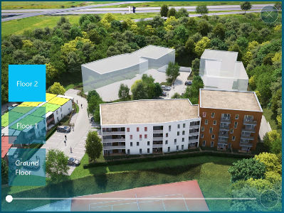

# Séquences : vue à 360

## Résumé
* [Description](#description)
* [Actions dans Compositeur Digital UX](#actions-dans-compositeur-digital-ux)
* [Extension de dosier](#extension-de-dossier)
* [Créer une séquence](#créer-une-séquence)
* [Layers](#layers)
* [Hot spots](#hot-spots)
* [Téléchargez un exemple](#télécharger-un-exemple)

## Description

Ce type de contenu vous permet d'afficher une vue à 360° de n'importe quel objet, en utilisant une séquence d'images pré-rendues (par exemple des bâtiments).

Les séquences prennent également en charge les hot spots : vous pouvez définir des zones sur chaque diapositive de votre séquence pour créer des zones interactives. Lorsque ces zones sont touchées, elles ouvrent le contenu auquel elles sont liées. Dans l'image ci-dessous, les zones actives apparaissent en rouge.

## Actions dans Compositeur Digital UX

Les séquences prennent en charge l'action suivante. Pour avoir un aperçu complet de chaque action, [voir la section Actions](actions.md)

**Menu des actions**

| Capturer | Dupliquer | Ouvrir dans l'app native | Enregistrer sous | Sélection | Partager |
|:--------:|:---------:|:------------------------:|:----------------:|:---------:|:--------:|
| &#x2714; | &#x2714;  | &#x2716;                 | &#x2716;         | &#x2714;  | &#x2716; |

**Interaction avec le contenu**

| Layers   | Déplacement angle de vue | Hot spots |
|:--------:|:------------------------:|:----------|
| &#x2714; | &#x2714;                 | &#x2714;  |

## Extension de dossier

Pour utiliser une séquence, placez toutes les images qui composent votre séquence dans un dossier, et ajoutez l'extension `.sequence` à la fin du nom de votre dossier. À l'intérieur de votre séquence, n'utilisez que les fichiers qui se terminent par `.jpeg`, `.jpg` ou `.png`.

## Créer une séquence

1. Dans votre dossier univers, créez un dossier nommé `<Nom de votre séquence>.sequence` (par exemple `Ma séquence.sequence`).
2. Glissez et déposez dans ce dossier tous les fichiers qui composent votre séquence.
3. (Facultatif) Si vous voulez afficher plusieurs layers, ajoutez un dossier pour chaque layer à l'intérieur de votre dossier `.sequence`. Ensuite, mettez toutes les images dont vous avez besoin pour chaque layer dans leur dossier. Le dossier représentant un layer peut se terminer par `.sequence` ou non.

## Layers

Si vous avez plusieurs layers à afficher (les différents étages d'un bâtiment par exemple), vous pouvez organiser vos dossiers d'images pour chaque layer, et les placer dans un dossier global .sequence.

Voici un exemple :

* Bâtiment.séquence
  * Rez-de-chaussée
    * 001.png
    * 002.png
  * Étage 1
    * 001.png
    * 002.png
...

Les couches seront classées par leur nom, de bas en haut, c'est-à-dire :

...
* Étage 1
* Rez-de-chaussée

 

## Hot spots

Un exemple contenant les définitions des zones actives pour les séquences est disponible dans la section ci-dessous.

## Télécharger un exemple

Un univers de démonstration contenant un exemple de sequence est disponible, [essayez-le!](../../../en/organise_content/Demo-Universe.zip) &#x1f604;

Suivant : [Simulateur de prêt (format Compositeur Digital UX)](simulator.md)

[Retour aux contenus pris en charge](index.md)
