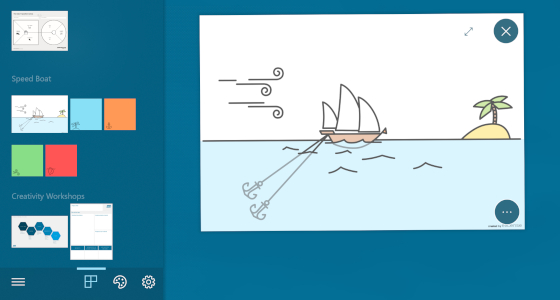

# Création de modèles

## Résumé
* [Description](#description)
* [Actions au sein de Compositeur Digital UX] (#actions-au-sein-du-compositeur-digital-ux)
* [Extension de contenu](#extension-de-contenu)
   * [Modèles de notes] (#modèles-de-notes)
   * [Modèles de feuille blanche](#modèles-de-feuille-blanche)
   * [Modèles avec entrées de texte] (#modèles-avec-entrées-de-texte)

## Description

Le Compositeur Digital UX vous permet de mettre des modèles à l'intérieur de votre univers. Un modèle est un document qui peut être instancié autant de fois que nécessaire.
Les modèles sont utiles lorsqu'il s'agit d'appliquer des méthodes spécifiques qui nécessitent beaucoup de documents (par exemple, la méthode "Speedboat"). Ils vous permettent de ne pas avoir trop de documents à l'intérieur de votre univers.

Les modèles sont accessibles à partir du menu principal.

Les modèles sont également un bon moyen de marquer vos notes et vos feuilles blanches afin de respecter vos directives de conception en termes de documents.

## Actions dans le Compositeur Digital UX

Selon le type de fichier (c'est-à-dire diaporama ou images...), consultez la page correspondante :
* [Actions avec images](images.md#actions-au-sein-du-compositeur-digital-ux)
* [Actions avec diaporamas](slideshows.md#actions-au-sein-du-compositeur-digital-ux)

## Extension du contenu

Tous les modèles sont situés à la racine du dossier de votre univers, dans un dossier appelé `_toolbox`.

À l'intérieur de ce dossier, vous pouvez créer autant de dossiers que vous le souhaitez, et y placer des images ou des documents de présentation (`.jpg`, `.png`, `.pdf`, `pptx`).

[Voir comment utiliser les modèles dans le Compositeur Digital UX](../../user_guide/workflow.md#use-templates)

### Modèles de notes

Si vous voulez ajouter de nouveaux modèles pour vos Notes, à l'intérieur de votre dossier `_toolbox`, créez un dossier nommé `notes`. Dans ce dossier, vous ajoutez des images (`.jpeg`, `.jpg`, `.png`) qui se comporteront comme des notes.

### Modèles de feuille blanche

Si vous voulez ajouter de nouveaux modèles pour vos feuilles blanches, à l'intérieur de votre dossier `_toolbox`, créez un dossier nommé `papers`. Dans ce dossier, vous ajoutez des images (`.jpeg`, `.jpg`, `.png`) qui se comporteront comme des feuilles blanches.

! [Dossier Modèles](../../../en/img/content_template_folder.JPG)

### Modèles avec saisie de texte

Si vous souhaitez ajouter de nouveaux modèles qui intègrent la saisie de champs de texte, ajoutez une zone de texte à partir de PowerPoint et faites-la commencer par un '@'.

[PowerPoint, zone de texte avec @](../../../en/img/content_template_text.JPG)

Ensuite, lorsque le modèle sera affiché dans Compositeur Digital UX, si l'utilisateur saisit dans le champ de texte, le clavier virtuel apparaîtra et le champ de texte sera rempli avec le texte saisi.

[Modèle avec texte, Compositeur Digital UX](../../../en/img/content_template_text_cdux.JPG)

suivant : [Actions récapitulatives](actions.md)

[Retour au contenu pris en charge](index.md)