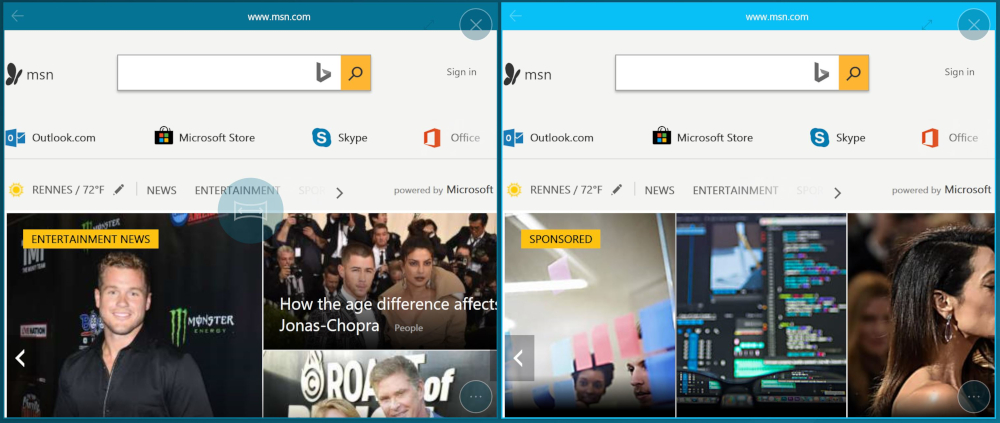
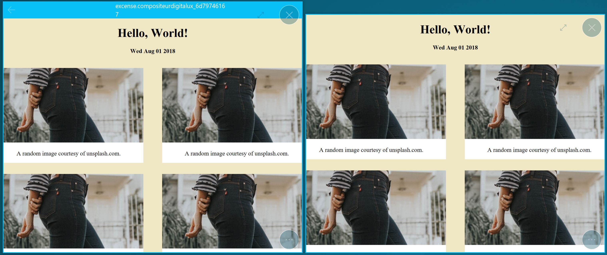

# Pages web

## Résumé
* [Description](#description)
* [Actions dans Compositeur Digital UX](#actions-dans-compositeur-digital-ux)
* [Extensions de dossier et fichiers](#extensions-de-dossiers-et-fichiers)
  * [Je veux afficher un site web dans Compositeur Digital UX](#je-veux-afficher-un-site-web-dans-compositeur-digital-ux)
  * [Je veux afficher une page Html locale](#je-veux-afficher-une-page-html-locale)
  * [Je veux afficher un lien vers un site web qui sera ouvert dans un navigateur web](#je-veux-afficher-un-lien-vers-un-site-web-qui-sera-ouvert-dans-un-navigateur-web)
* [Interactions avec Compositeur Digital UX](#interactions-avec-compositeur-digital-ux)
* [Métadonnées disponibles](#métadonnées-disponibles)
* [Téléchargez un exemple](#télécharger-un-exemple)

## Description

Ce contenu vous permet d'afficher un contenu html local, ou une page de site web à l'intérieur de votre Compositeur Digital UX. Les pages du site web peuvent également être affichées sous forme de liens, de sorte que lorsqu'elles sont sélectionnées, un navigateur web externe les affiche.

Pour interagir avec une page web, appuyez sur le bouton de navigation au centre de l'élément : Cela déclenchera le mode de navigation.


En mode navigation, vous pouvez interagir avec le contenu affiché dans l'aperçu du site de la même manière que vous le feriez dans un navigateur web. Toutefois, les actions de manipulation (déplacement, zoom, rotation) que vous pouvez utiliser normalement sur tous les documents sont désactivées (sauf si vous touchez le document sur sa barre supérieure, où est inscrit le nom du site web). Appuyez sur le bouton 'Fin de la navigation' (à côté du bouton d'action) pour mettre fin à la navigation.


## Actions dans Compositeur Digital UX

Les éléments de la page web prennent en charge les actions suivantes. Pour avoir un aperçu complet de chaque action, [voir la section Actions](actions.md)

**Menu des actions**

| Capturer  | Dupliquer | Ouvrir dans l'app native | Enregistrer sous | Sélection | Partager  | 
|:---------:|:---------:|:------------------------:|:----------------:|:---------:|:---------:|
| &#x2716;  | &#x2714;  | &#x2716;                 | &#x2716;         | &#x2714;  | &#x2716;  |

**Interaction avec le contenu**

| Annoter | Mode de navigation | Interaction avec la page web |
|:-------:|:------------------:|:----------------------------:|
| &#x2714;| &#x2714;           | &#x2714; |

## Extensions de dossier et fichiers

En fonction de votre objectif, vous disposez de plusieurs extensions de contenu qui peuvent être utilisées.

### Je veux afficher un site web dans Compositeur Digital UX

Pour afficher un lien de site web qui sera ouvert dans un navigateur web, créez un fichier nommé `<NomDeMonSite>.cdurl`. À l'intérieur de ce fichier, ajoutez une ligne :
`url = <UrlOfMySite>`, par exemple, `url = https://www.msn.com/en-us/`


### Je veux afficher une page Html locale

Pour afficher une page Html locale, créez un dossier et ajoutez l'extension `.html` ou `.web` à la fin du nom de votre dossier. Dans votre dossier `.web`, vous pouvez utiliser les fichiers `css`, `htm`, `html` et `js`. Vous pouvez également utiliser des images.

Si vous avez plusieurs fichiers `html` dans ce dossier, par défaut, Compositeur Digital UX cherchera un fichier nommé `index.hmtl`. Si aucun fichier de ce type ne peut être trouvé, le fichier de départ sera le premier par ordre alphabétique.


### Je veux afficher un lien vers un site web qui sera ouvert dans un navigateur web

Pour afficher un site web dans un navigateur web, vous avez besoin d'un fichier `.cdurl` et d'un fichier `meta`. Les métadonnées sont très utiles pour personnaliser le fonctionnement de votre Compositeur Digital UX. [Consultez la section sur les métadonnées pour plus d'informations](../advanced_setting.md).

Pour afficher un lien de site web qui sera ouvert dans un navigateur web, créez un fichier nommé `<NomDeMonSite>.cdurl`. À l'intérieur de ce fichier, ajoutez une ligne :
`url = <UrlOfMySite>`, par exemple, `url = https://www.msn.com/en-us/`

Créez un fichier nommé `<NomDeVotreFichierCdurl>_meta.txt`, par exemple, j'ai un fichier `.cdurl` nommé `msn.cdurl`, mon méta-fichier devrait être nommé `msn_meta.txt`.

À l'intérieur de ce méta-fichier, ajoutez une ligne : `table.viewer = extern`.
Avec cette ligne, la page web sera ouverte dans votre navigateur par défaut.


### Interactions avec Compositeur Digital UX

Avec le contenu html, vous pouvez avoir une interaction entre votre page web et Compositeur Digital UX en utilisant Javascript.
Toutes les actions sont disponibles via l'objet `CDUX`.

**openItem**(chemin de la chaîne de caractères)
<br />ouvrez un élément de votre univers en donnant son chemin relatif depuis votre webview
```HTML
<a href="javascript:CDUX.openItem('../image.jpg');">image ouverte</a>
<a href="javascript:CDUX.openItem('2ndPage.html?name=test');">ouvrir un nouveau site web</a>
```

**importItem**(string base64, string filename)
<br />Importez et ouvrez un fichier à partir de données binaires
```javascript
var pdf = new jsPDF();
/* generate a pdf */
var byteArray = pdf.output('arraybuffer');
CDUX.importItem(window.btoa(byteArray), 'My File.pdf');
```

**SetJsonProjectData**(dataKey de la chaîne, valeur de la chaîne)
<br />stocker la valeur (objet primitif ou complexe) dans le projet sous la clé donnée

**GetJsonProjectData**(datakey de la chaîne)
<br /> récupérer la valeur stockée dans le projet sous la clé donnée

**SetJsonInstanceData**(dataKey de la chaîne, valeur de la chaîne)
<br />stocker la valeur (objet primitif ou complexe) dans l'instance webview sous la clé donnée

**GetJsonInstanceData**(dataKey de la chaîne) : récupère la valeur stockée dans l'instance webview sous la clé donnée

**RegisterProjectDataChangedCallback**(dataKey de la chaîne, chaîne callBackFunctionName, bool sendNewValueAsArgument)
<br />s'abonner aux changements de données du projet à la clé donnée. Chaque fois que la valeur est modifiée (ou une sous-valeur de la clé donnée), la fonction donnée en paramètre est appelée, avec ou sans envoi de la nouvelle valeur en paramètre.

**UnRegisterProjectDataChangedCallback**(dataKey de la chaîne)
<br /> désabonnement aux changements du projet pour cette clé

**RegisterInstanceDataChangedCallback**(dataKey de la chaîne, chaîne callBackFunctionName, bool sendNewValueAsArgument)
<br />s'abonner aux changements de données d'instance à la clé donnée. Chaque fois que la valeur est modifiée (ou une sous-valeur de la clé donnée), la fonction donnée en paramètre est appelée, avec ou sans envoi de la nouvelle valeur en paramètre.

**UnregisterInstanceDataChangedCallback**(dataKey de la chaîne)
<br /> désabonnement aux changements d'instance pour cette clé

**Données relatives aux projets et aux instances**
<br />Les données de projet sont partagées avec tous les autres documents alors que les données d'instance ne concernent que l'instance actuelle de votre document (Notez que les données d'instance seront copiées au cas où vous dupliqueriez l'aperçu du site).
Avec ProjectData, vous pouvez interagir avec les valeurs d'un autre aperçu sur le web, mais aussi d'un [Quiz](quiz.md), d'un [Formulaire](form.md) ou d'un [Simulateur de prêt hypothécaire](simulateur.md)

**Exemples**
```javascript
    var objectValue = { 'name' : 'Marc Dupont', 'phoneNumber' : '06 12 24 49 33' }
    CDUX.setJsonProjectData('school.director', JSON.stringify(objectValue)) ;
    
    // pour récupérer ultérieurement cette valeur, utilisez :
    var director = JSON.parse(CDUX.getJsonProjectData('school.director')) ;
    
    //si vous voulez seulement obtenir le nom, vous pouvez aussi utiliser une clé plus précise :
    var directorName = JSON.parse(CDUX.getJsonProjectData('school.director.name')) ;
    
    // pour être averti d'un changement de numéro de téléphone :
    fonction phoneChanged() { }
    CDUX.registerProjectDataChangedCallback('school.director.phoneNumber', phoneChanged.name, false) ;
    
    // pour être averti de tout changement dans l'objet du directeur :
    fonction infoChanged() { }
    CDUX.registerProjectDataChangedCallback('school.director', infoChanged.name, false) ;
 ```   

**Déclassé** * : les méthodes ci-dessous ne sont conservées que pour des raisons de légalité.
<br />getProjectData : récupérer une valeur stockée sur le projet en cours en donnant sa clé
```javascript
`var budget = CDUX.getProjectData("firstName");
```
<br />setProjectData : définit une valeur sur le projet en cours pour une clé donnée
```javascript
CDUX.setProjectData("finance.budget", 600000);
```
<br />getInstanceData : récupère une valeur stockée sur l'instance de la page courante en donnant sa clé
```javascript
var value = CDUX.getInstanceData("questionnay.thirdAnswer");
```
<br />setInstanceData : définit une valeur sur la page en cours pour une clé donnée
```javascript
CDUX.setInstanceData("questionnay.thirdAnswer", "Yes");
```

### Résumé

|          | Site web (CDUX) | Lien vers le site web (navigateur web) | Contenu Html local        |
|:--------:|:----------------|:---------------------------------------|:--------------------------|
|Extensions| `cdurl`         | `cdurl` + `_meta`                      | Dossier `.html` ou `.web` |

## Métadonnées disponibles

Les métadonnées vous aideront à personnaliser le comportement de votre navigateur web.

| Clé des métadonnées        | Valeur                | Description |
|:--------------------------:|:----------------------|:------------|
| `table.viewer`             | cdux                  | S'assure que le lien `cdurl` sera affiché dans le Compositeur Digital UX |
|  Mode de manipulation Web  | `toggle` ou `intégré` | Si `toggle`, tous les mouvements tactiles agissent uniquement sur le conteneur jusqu'à ce que l'utilisateur active le mode de navigation, alors toutes les interactions sont transmises au contenu Web. S'il est "intégré", les simples pressions sont transmises au contenu web tandis que les mouvements tactiles plus complexes (glisser, zoom, ...) déplaceront le conteneur |
| `web.showChrome`           | Vrai ou faux          | Si vrai, une barre de navigation en haut de la vue s'affiche. Sinon, aucune barre de navigation ne sera affichée. |
| `web.viewport.width`       | 1000 (nombre)         | Définit la largeur par défaut de la vue.                                       |
| `web.viewport.height`      | 800 (nombre)          | Définit la hauteur par défaut de la vue.                                      |
| `web.nossl` | Vrai ou faux | Désactive les contrôles SSL et permet de naviguer sur des pages dont les certificats ne sont pas reconnus. |
| `web.newWindow.*`          | -                     | Les metadonnées préfixées de `web.newWindow` seront appliquées aux fen^tres ouvertes à partir de la page courante. Si aucune clé `web.newWindow` n'est spécifiée, les métadonnées courantes seront appliquées. |  

Par défaut, le lien `cdurl` a les métadonnées `web.manipulationMode` définies à 1 et les métadonnées `web.showChrome` définies à Vrai.

Les dossiers ayant l'extension `.web` ou `html` ont les métadonnées `.web.manipulationMode` à 0 et les métadonnées `.web.showChrome` à Faux.

Mode de navigation à 1 (gauche) et 0 (droite)



ShowChrome True (à gauche) et ShowChrome False (à droite)



## Télécharger un exemple

Un univers de démonstration qui contient des exemples de contenu de pages web est disponible, [essayez-le!](../../../en/organise_content/Demo-Universe.zip) &#x1f604;

Suivant : [Formulaires](form.md)

[Retour aux Contenus pris en charge](index.md)
