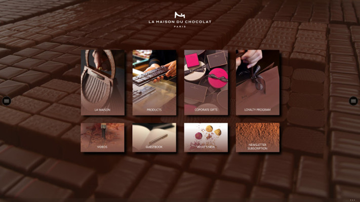
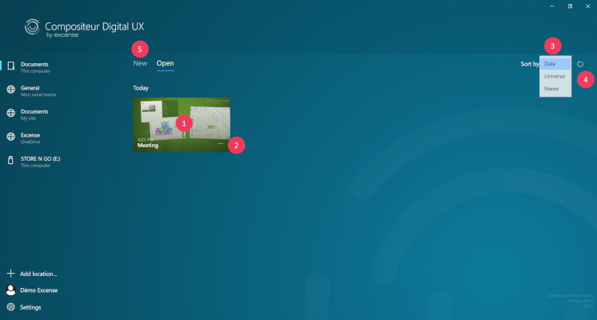
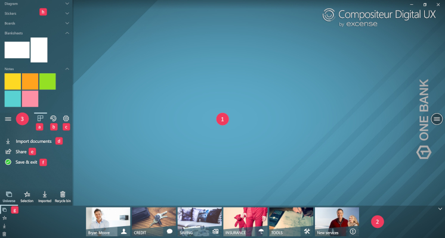
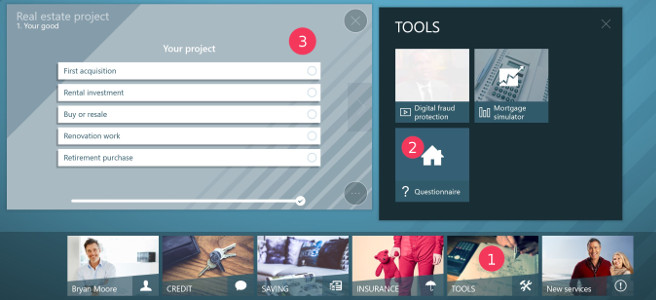

# Présentation 

Le Compositeur Digital UX est une solution unique pour améliorer les présentations professionnelles lors de réunions en face à face. 
Exploitez tous vos fichiers existants (PDF, PowerPoint, images, vidéos) pour réaliser des ventes à forte valeur ajoutée ou stimuler la collaboration.

Le Compositeur Digital UX vous permet de 
* Créer des liens entre vos documents pour une présentation structurée et une narration immersive
* Apporter des annotations en direct à tout document
* Ajouter des notes autocollantes sur vos documents importants
* Importer en direct tout document dont vous avez besoin pendant votre présentation
* Collaborer et donner vie aux idées de votre équipe

Passez à la vitesse supérieure avec vos présentations en face à face et libérez le pouvoir de l'interaction avec votre public !

## Résumé
* [Vocabulaire](#vocabulaire)
* [Vue d'ensemble](#vue-densemble)
  * [Exemples](#exemples)
  * [Univers](#univers)
  * [Projets](#projets)
  * [Espace de travail](#espace-de-travail)
    * [Ouvrir un document](#ouvrir-un-document)
    * [Manipuler un document](#manipuler-un-document)
    * [Fermer un document](#fermer-un-document)

## Vocabulaire

* **Univers** : un univers est un dossier Windows qui contient un ensemble de documents, d'images, de vidéos, de modèles 3D qui seront utilisés lors de votre session de travail. Pendant votre travail dans l'espace de travail, les modifications apportées à ces fichiers peuvent être enregistrées dans différents projets.
* **Projets** : un projet contient tout le travail que vous avez réalisé dans un univers : annotations, documents ouverts et manipulés, etc. Chaque projet est rattaché à un univers.
* **Espace de travail** : l'espace de travail vous permet d'ouvrir, de visualiser et de manipuler différents types de documents : images, pdf, powerpoints, vidéo, etc... En utilisant le crayon, vous pouvez écrire des annotations sur vos documents.
*Source** : une source contient un ensemble d'univers. Trois types de sources existent :
   * *Une source locale* : c'est un dossier sur votre ordinateur (par exemple, la source par défaut utilise le chemin `<HD>\<utilisateur>\Documents\Compositeur Digital UX`. Ce dossier contient les univers qui sont enregistrés sur votre ordinateur.
   * *sources clé USB* : il s'agit d'un dossier sur une clé USB (par exemple `<KEY>\Compositeur Digital UX`). Lorsque vous utilisez des clés USB, vous pouvez démarrer un projet sur un appareil, enregistrer votre projet sur votre clé, puis continuer à travailler sur votre projet en utilisant un autre appareil.
   * *Sources du cloud* : il s'agit du canal Microsoft Teams ou d'un site SharePoint de votre organisation. Vous avez besoin d'un accès à Internet et d'un tenant Office365 pour utiliser les sources du cloud.

## Vue d'ensemble

### Exemples

Un univers avec un arrière-plan interactif, parfait pour les appareils en libre-service !

Contexte bancaire, réunion en face à face.

Industrie, réunion d'examen des produits.

### Univers

La page d'accueil du Compositeur Digital UX présente tous les univers disponibles dans une source donnée. 

1. La liste de toutes les sources disponibles. Dans cet exemple, il y a une source locale (`Documents`), trois sources du cloud, et une source usb.
1. L'onglet 'Nouveau' affiche tous les univers disponibles dans la source. 
1. L'onglet "Ouvrir" contient tous les projets lancés sur cette source.
1. Un bouton de rafraîchissement vous permet de recharger la source si vous avez créé de nouveaux univers, ou si vous avez supprimé certains univers.
1. Le panneau du bas vous permet d'ajouter rapidement de nouvelles sources (sources locales ou cloud), de vous connecter à votre tenant Office 365, et d'accéder aux paramètres de l'application. À partir des paramètres, vous pouvez ajouter votre licence Compositeur Digital. 

Vous pouvez démarrer un espace de travail vide en cliquant sur :

### Projets

En cliquant sur "Ouvrir", vous accédez aux projets sur lesquels vous avez travaillé. Tous les projets que vous avez enregistrés apparaissent ici.

1. En cliquant sur une vignette de projet, vous ouvrirez le projet exactement comme vous l'avez laissé.
1. En cliquant sur les trois points, vous verrez apparaître un menu contextuel qui vous permettra de partager, de supprimer ou d'afficher des informations sur votre projet.
1. Vous pouvez trier vos projets selon leur nom, la date à laquelle ils ont été consultés ou l'univers auquel ils sont liés. 
1. Le bouton de rafraîchissement forcera la source à être rafraîchie. Il rafraîchit à la fois les univers et les projets.
1. L'onglet "Nouveau" vous montrera les univers disponibles dans la source actuelle.

### Espace de travail

Une fois que vous avez décidé sur quel projet ou univers vous voulez travailler, appuyez sur l'icône du projet/univers pour lancer l'espace de travail.
L'espace de travail est divisé en 3 zones :

1. L'espace de travail : un espace collaboratif, pour afficher, manipuler et éditer le contenu.
1. Un dock pour naviguer et accéder à votre contenu.
1. Le bouton de menu, disponible à droite et à gauche de l'écran, utile pour : 
   - a. Ajouter des notes, des feuilles blanches, des autocollants ou des modèles.
   - b. Changer le type d'encre et la couleur de votre stylo, utiliser votre doigt pour dessiner sur des documents, etc.
   - c. Accéder aux paramètres de votre projet : vous pouvez activer/désactiver des options telles que la bande ou la rotation à partir de ce menu.
   - d. Importer des documents : sélectionnez une liste de fichiers, collez le contenu de votre presse-papiers, faites une capture d'écran d'une autre application.
   - e. Partager votre travail
   - f. Sauvegarder votre projet
   - g. Visualiser tous vos documents : sélection, documents importés, corbeille, univers.
   - h. Parcourir tous les modèles disponibles : autocollants, schémas, tableaux...

#### Ouvrir un document

1. Sur le dock, appuyez sur le dossier pour l'ouvrir.
1. Dans la vue du dossier, appuyez sur n'importe quel document pour l'afficher.
1. Votre élément est maintenant affiché dans l'espace de travail.

#### Manipuler un document

Le Compositeur Digital UX a été conçu pour être utilisé avec des interactions et des gestes tactiles.
Les gestes suivants sont pris en charge :
1. Déplacement.
1. Pression / écartement pour zoomer / dé-zoomer.
1. Rotation

#### Fermer un document

Un document peut être fermé en appuyant sur la croix située dans le coin supérieur droit.

Vous pouvez également fermer un document en le déposant sur les bords de votre écran. Si vous appliquez une force suffisante, le document sera retiré de l'espace de travail. 

**Important** : un document que vous avez fermé n'est jamais perdu. Vous pouvez le récupérer dans "Historique".

Suivant : [Workflow](workflow.md)

[Retour au guide de l'utilisateur](index.md)
